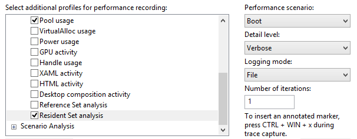
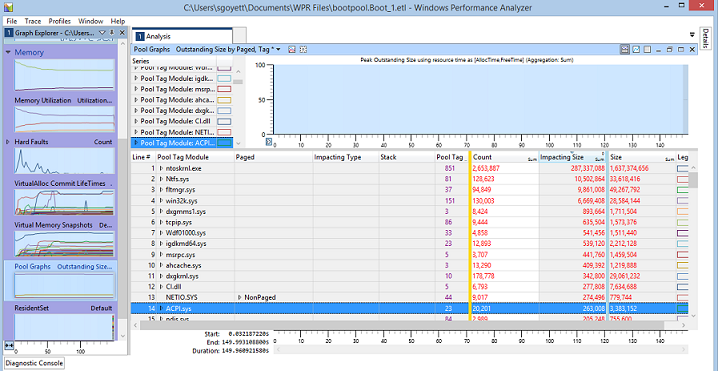
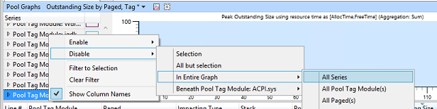
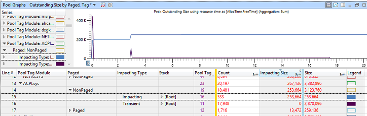
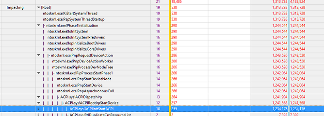
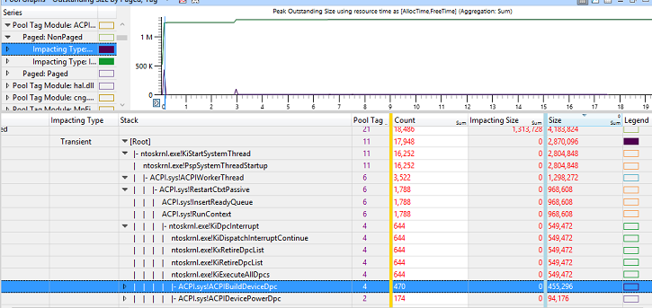
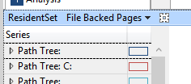
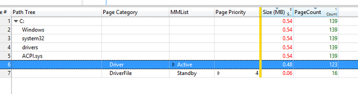

# 练习 3-跟踪驱动程序占用空间和启动过程的动态分配

**池**是用于存储其数据结构的操作系统和设备驱动程序的内核模式组件的内存资源。 池有四个基本分配区域︰

1.  **非页面缓冲的池︰**有保证的驻留在物理内存中分配。

2.  **页面缓冲池︰**分配的可分页到页面文件的内存不足。

3.  **NX 非分页池︰**非页面缓冲分配，这不是可执行文件。

4.  **会话池︰**每个会话中进行的分配。 这些都是可分页。

池使用的计算机上的总体内存使用情况的重大贡献，它在启动后立即是内存的最大使用者。 池使用缩减非分页内存 （用于） 驱动器降低到最高优先级类别与跨操作系统，减少系统的总体内存使用情况。

在此练习中，将在启动过程中查看收件箱 Microsoft 驱动程序分配和其占地面积 （在其初始化时）。

## 步骤 1︰ 收集池内存跟踪跨引导过渡

在此步骤中，您将收集使用**Windows 性能记录器 (WPR)**包含池和驻留集数据启动跟踪。

1.  从**「 开始 」**菜单打开**WPR**

2.  选择正确的事件提供程序︰

    1.  **池的使用率**

    2.  **驻留集**

    3.  **第一级别会审**

3.  选择与**性能方案****启动**。

4.  为**日志记录模式**，请选择**文件**。

5.  1 设置为**迭代次数**。

6.  单击**开始**，然后选择一个位置来保存该 ETL 文件。

系统会自动重新启动、 收集进行跟踪，并停止后桌面变得可见。

## 步骤 2︰ 查看池数据使用 WPA

通过在**WPA**的**池图形**摘要表公开**池**数据。 下表中所感兴趣的列。

您可以添加或移除列，如果您用鼠标右键单击列标题上。

| 术语     | 说明                                                                                            |
|-----------------|--------------------------------------------------------------------------------------------------------|
| 池标记        | 池分配关联的标记。                                                             |
| 池标记模块 | 使用池标记相关的模块 （驱动程序）。                                                        |
| Stack           | 导致内存分配的线程上显示的代码路径。                                        |
| Paged           | 指示分配了放入页面缓冲池或非分页池。              |
| 影响类型  | 显示分配是否稳定状态内存使用可能会导致或暂时分配。 |

 

1.  **WPA**使用步骤 1 中打开您捕获的跟踪。

2.  打开**跟踪**菜单中，选择**配置符号路径**。

    -   指定符号高速缓存的路径。 符号的详细信息，请参阅 MSDN 上的[符号支持](https://go.microsoft.com/fwlink/?linkid=623019)页。

3.  打开**跟踪**菜单中，选择**加载符号**。

4.  **图形资源管理器中**的**内存**类别中找到**池**图

5.  拖放到**分析**选项卡上的**库**图。

6.  要显示这些列的表来组织︰

    1.  **池标记模块**

    2.  **分页**

    3.  **影响类型**

    4.  **堆栈**

    5.  **池标记**

    6.  **计数**

    7.  **影响大小**和**大小**

    **上池标记的笔记︰**

    如果驱动程序开发人员，请确保您的驱动程序所使用的池标记清晰、 易于识别，便于分析。 例如，如果您的公司名为 Fabrikam，您可以将"Fbk"前缀添加到池的所有标记︰ FbkPool1、 FbkPool2、 FbkBuffer，等等。

    

7.  禁用所有系列在图表上的 (用鼠标右键单击-&gt; **都禁用** - &gt; **在整个图形** - &gt; **所有系列**)

    

8.  通过单击的**影响大小**列标题上的影响大小进行排序。

    在顶部显示具有最高的稳态内存使用率的驱动程序。

## 第 3 步︰ 截距池分配数据

1.  放大时间线的前 30 秒。

2.  选择一个驱动程序 （例如，ACPI.sys，但任何将执行操作）。

    1.  查看**未分页**内存并展开的行。

        **未分页**内存应调查的重点，如其不能移动到页面文件系统上的内存压力时。

    2.  启用**Impacting**和**暂时性**类别**图例**。

        

3.  通过单击列标题按**影响大小**进行排序。

4.  **Impacting**内存直接分配给该驱动程序的总内存占用任何时候。 在前面的示例中，您可以判断，ACPI.sys 在所有情况下，使用一些非分页内存以及这稳定状态的使用增加了两倍 （名字时加载该驱动程序，然后在大约 3 秒第二次）。

    1.  展开堆栈，并通过它导航。 在顶部，您会看到导致的最大稳定池分配的函数调用。

    2.  在以下示例中，您可以看到 ACPI.sys 使 255 池分配，总在**ACPIInitStartACPI**函数下合计 1.2 m B。 这是驱动程序开发人员应重点放在何处以提高驱动程序处于稳定状态的内存使用情况，为此函数帐户等大多数驱动程序分配。

        

5.  通过单击列标题按**大小**排序。

6.  执行**暂时性**的类别相同的操作。 展开堆栈，并通过它导航。 在顶部，您会看到导致的最大瞬态的池分配的函数调用。

    -   在以下示例中，您可以看到初始峰值暂时内存分配状况主要由 ACPI 执行 Dpc 的设备 (**ACPI.sys ！ACPIBuildDeviceDpc**)。 引入此函数调用代码峰值总计 455 KB。

        

## 第 4 步︰ 测量驱动程序代码空间

1.  **图形资源管理器中**的**内存**类别中找到**驻留集**关系图。

2.  拖放到分析选项卡上的**居民设置**关系图。

3.  请确保 unzoom 图形 (Ctrl + Shift +"-")。

4.  选择的**文件备份页**图形预设。

    

5.  **路径树**列中，通过导航到您在步骤 3 中 (例如，在驱动程序 c: / Windows 下的 ACPI.sys) 选定的驱动程序。

6.  展开**驱动程序**类别并将重点放在**活动**页上。

    在**大小**列中的值表示驱动程序代码在内存占用量的影响。 在以下示例中，它为 0.48 MB。

 

 

