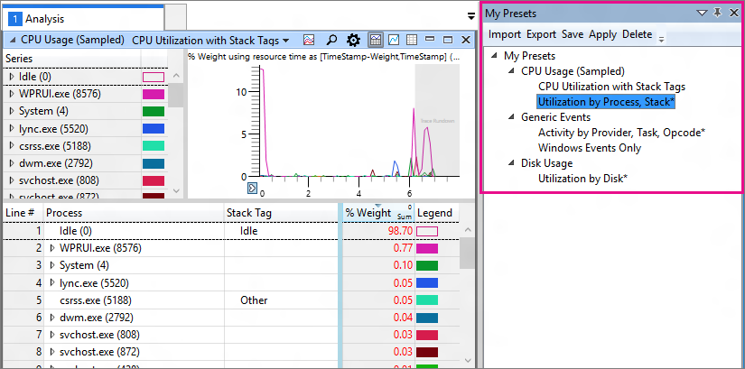

# 我预设

WPA 存储预设已修改或显式保存并将其显示在**我的预设**窗口，以便您可以方便地重用它们。 **我的预设**包含一个工具栏和以路径树显示。 跨使用 WPA 和 （但未保存预设，不在打开实例之间共享） 的同时打开实例共享窗口中的内容。

树显示具有已保存或修改预设的条目。 在此项下预设它们来自该图按分组。 预设的名称旁边的星号表示具有已修改但尚未保存。 为灰色，无法使用名称指示当前跟踪，有没有相应的关系图的数据。 之后应用配置文件，配置文件将显示在一个单独的条目，以及图形和预设它包含。

您可以访问预设在工具栏或右键单击预设，然后再选择下表中描述的选项的命令。

| 选项 | 说明 |
|---|---|
| **导入** | 从预设导入预设 (。WpaPresets) 文件或配置文件中的打开预设 (。WpaProfile) 文件。 |
| **导出** | 所选的预设导出到文件中，以便您可以共享预设。 该文件具有扩展名*。WpaPresets*。 |
| **保存** | 保存预设的当前的状态。 如果预设是内置预设的已被修改，然后 WPA 显示**另存为**对话框中，因为内置预设不能被覆盖。 请注意，如果同一个预设的多个实例处于打开状态，最近修改实例被保存。 |
| **应用** | 将应用最近使用过的**分析视图**或**比较分析视图**中的预设。 您还可以通过双击其名称应用预设。 |
| **删除** | 从该视图删除预设并恢复此预设在关系图中打开的任何实例。 |
 

在此视图中的预设保持同步与非默认预设每个关系图 （通过打开的关系图上的跟踪名称旁边的下拉列表菜单访问）。 保存、 修改或删除一个位置中的某个预设会相互影响。
