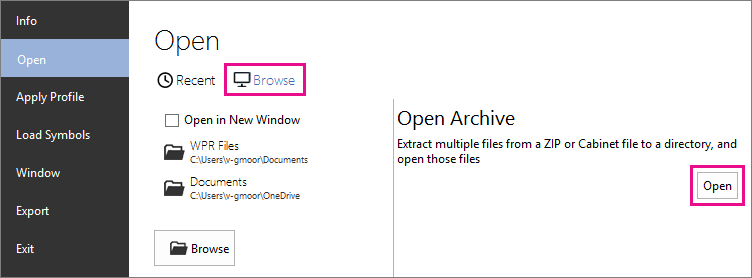
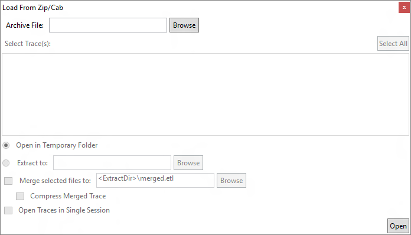

# 在 WPA 打开存档文件

WPA 可以打开压缩文件中包含的 ETL 文件和压缩文件，这两种常见的存档格式。 在 WPA，**负载从 Zip/Cab**，对话框允许从存档提取 ETL 文件归档文件和配置选项中的浏览文件。

本主题︰
- [在 WPA 打开存档文件](#opening)
- [元素和**负载从 Zip/Cab**中的选项](#options)
- [在 WPA 的合并跟踪](#merging)

## 打开存档文件

您可以通过打开**负载从 Zip/Cab** **文件&nbsp;>&nbsp;打开**浏览文件，与 WPA 可以打开的任何其他文件。 当您选择 zip 或 cab 文件时，WPA 自动打开**负载从 Zip/Cab**。 

如果您正在使用格式菜单上，**文件&nbsp;>&nbsp;打开**可以直接转到**负载从 Zip/Cab** ，单击**打开**在**打开存档文件**下选择**浏览**时。

## 元素和**负载从 Zip/Cab**中的选项

下图显示了**负载从 Zip/Cab**对话框。

下表中描述的元素和**负载从 Zip/Cab**的选项。

| 对话框元素 | 说明 |
|---|---|
| **归档文件&nbsp;文件** | 存档文件的路径和文件名称。 |
| **选择&nbsp;跟踪** | 所选的存档文件，其中包括嵌套的目录中的文件的列表。 |
| **提取&nbsp;到** | 为想要解压的 ETL 文件路径。 指定一个位置，是可选的。 如果不指定路径，ETL 文件解压缩到一个临时文件夹，删除后关闭 WPA。 |
| **合并&nbsp;选&nbsp;文件&nbsp;到** | 指定具有 WPA 将提取的 ETL 文件合并到单个的 ETL 文件的路径和文件名称。 这相当于**xperf**&nbsp;**-合并**。 |
| **压缩&nbsp;合并&nbsp;跟踪** | 选择此选项可使 WPA 压缩合并的文件。 这相当于**-压缩**选项使用**xperf**&nbsp;**-合并**。 |
| **打开&nbsp;跟踪&nbsp;在&nbsp;单个&nbsp;会话** | 选择此选项可在一起而不是将它们合并到一个新的跟踪分析多个跟踪。 否则，此选项没有为合并相同的限制。 |

## 在 WPA 的合并跟踪

当从存档提取 ETL 文件，您可以选择让 WPA 将跟踪记录合并到单个跟踪，它相当于**xperf**&nbsp;**-合并**。 如果您不选择合并跟踪记录，然后将打开所选存档文件中的所有痕迹，但 WPA 将考虑它们单独的跟踪。 

对于 Xperf，没有合并跟踪的限制。 一般情况下，它们必须在同一台计算机，并捕获在同一时间，无需重新启动。

