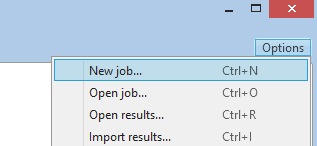
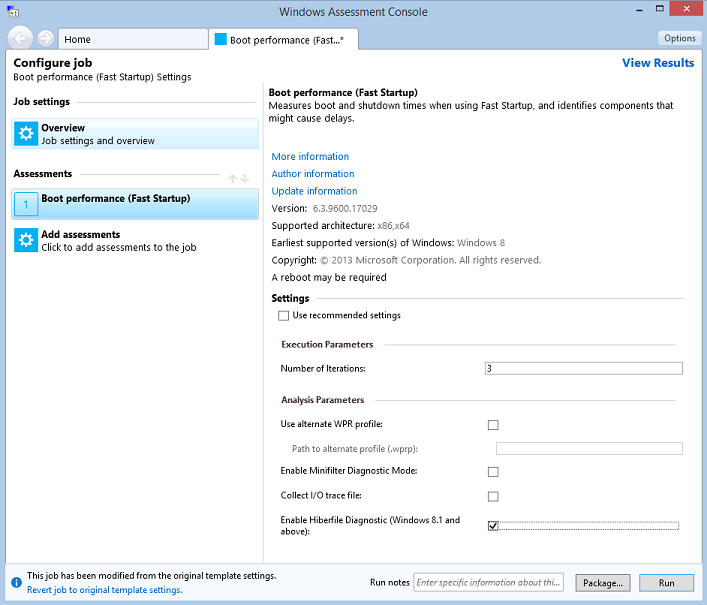
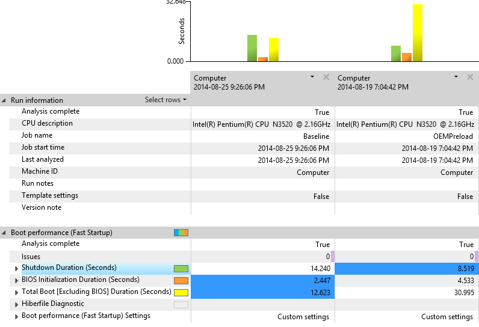
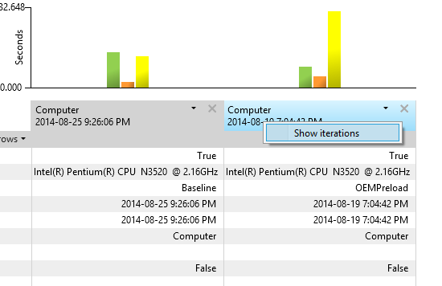
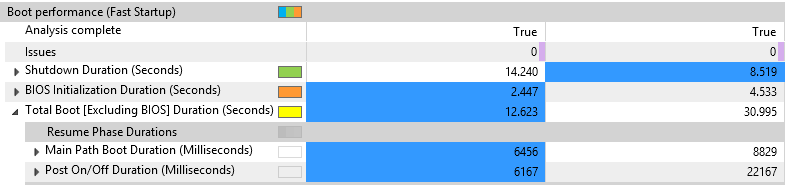
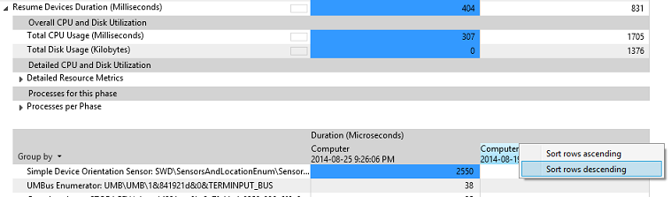
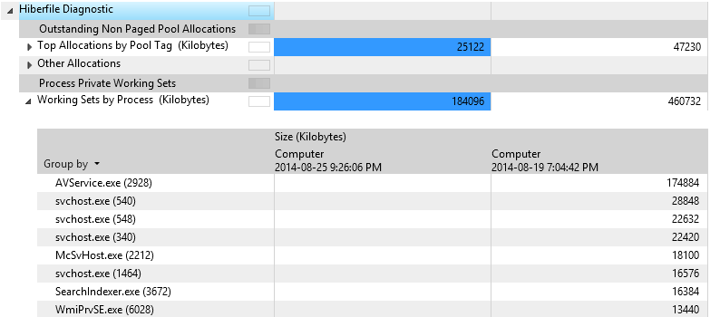
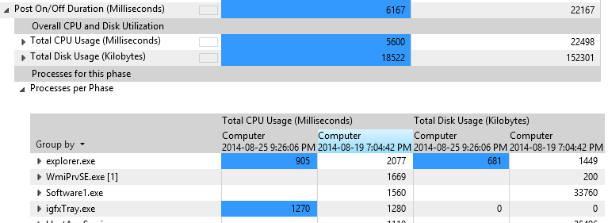
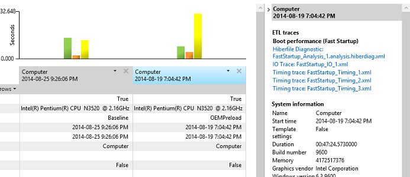

# 练习 1 – 评估使用评估 Toolkit 的快速启动

启动时是通常用来测量窗口性能通用准则。 一个系统的生命周期，启动时间较长可能指示器，如配置效率低、 设备冲突和恶意软件的系统问题。

## 步骤 1︰ 收集数据使用 Windows 评估工具包

Windows 评估 Toolkit 包含测试来测量快速启动时间。 此评估可用于了解影响驱动程序、 设备和预加载软件对快速启动时间。 快速启动时间可以受负面影响的进程和服务在启动、 流程和在后台运行的服务或资源用于初始化设备的内存中加载的。

1.  从**「 开始 」**菜单打开**Windows 评估控制台 (WAC)** 。

2.  打开**选项**菜单，然后选择**新作业...**

    1.  输入作业名称为**FastStartupTest** 。

    2.  选择**创建自定义作业。**

3.  单击**添加评估。**

    -   通过单击"+"符号添加**启动性能 （快速启动）**评估。

4.  单击新添加的**引导性能 （快速启动）**评估，输入测试配置。

5.  取消选中**使用推荐的设置**，配置的选择**启用后诊断**。

    -   **启用后诊断**允许您分析后的内容，并确定影响其大小的内存页。

6.  有两种选择︰

    1.  **包**作业以与测试的所有资源中创建一个文件夹并将其复制到另一个测试系统。 （请单击**包...** 按钮的右下角，请选择此选项。

    2.  **运行**作业直接在系统上。 （在右下角，请选择此选项中的**运行**按钮单击）。

        -   这将重新启动系统以收集跟踪。

        -   该测试可能需要 30 分钟才能完成。

    我们想**运行**选项。

    

## 步骤 2︰ 可视化 WAC 使用评估结果

评估执行完成后，可以打开**WAC**结果 XML 报告并开始评估的**快速启动**时间。

此步骤使用两个 XML 报表︰

-   **基线报告**(**FastStartup\_Baseline.xml**): 基线报告是可以下载的预生成的 XML 报表[此处](http://download.microsoft.com/download/3/6/F/36FDC105-5ECC-4C8A-98E4-385B940F74B5/FastStartup_Baseline.xml)。

    它是通过一套完整的驱动程序与干净 Windows 零售映像上执行的**快速启动**评估生成的。 比较基准，您可以了解系统最佳的情况下，没有任何添加的第三方应用程序。

-   **本地报表**︰ 这是您在步骤 1 中生成的报告。 基线报告和本报告之间的增量可以量化添加应用程序的影响对启动时间。

1.  **WAC**，在右上角，在打开**选项**菜单，选择**打开结果...**。

    -   您还可以按键盘上的**CTRL + R** 。

2.  单击**浏览...** 按钮，然后浏览到保存两个 XML 报表的文件夹。

3.  选择两个**FastStartup\_Baseline.xml**和**本地报表**在同一时间，并单击**打开**。

    两个结果在 Windows 评估控制台中打开并排比较。 您的控制台应如下所示︰

**请注意**  
由于**本地报表**一种用于生成整个本练习屏幕快照中所示**的本地报表**中的不同系统上生成的屏幕快照中所示的特定项目将与您在您的计算机看到的那些可能不同。

 

## 步骤 3︰ 检查快速启动报表

评估结果部分提供了了解系统的执行方式，找出问题，您将使用的数据。 大多数度量值是可用于与其他指标或计算机进行比较的数字。

| 阶段                                      | 说明                                                                                                                                                               |
|--------------------------------------------|---------------------------------------------------------------------------------------------------------------------------------------------------------------------------|
| **关闭持续时间 （秒）**            | 关闭计算机所用的时间。 您可以展开此节点可公开进行更深层次了解和调查的其他指标。                               |
| **BIOS 初始化持续时间 （秒）** | BIOS 初始化所用的时间。 评估不提供此度量分析和补救措施的信息。                                                |
| **总启动 （秒）**                   | 时间计算机启动后会 BIOS 阶段已完成。 您可以展开此节点可公开进行更深层次了解和调查的其他指标。 |

 

**用户提示︰**

**评估**通常多次运行工作负载或方案。 我们称这些运行的每个为"迭代"，并收集平均值跨多个迭代。 例如，**快速启动**默认有三个小版本。 若要查看单个迭代的值，请用鼠标右键单击列标题中的计算机名称，然后选择**显示迭代**。

启动性能 （快速启动） 评估提供大量的阶段和组件中的引导指标。

1.  在**WAC**，发现**总启动\[不包括 BIOS\]持续时间 （秒）**指标，和比较基准日期和本地结果。 您可能会看到一个大 （即大于 18 秒） 两者之间的回归时间。

2.  单击 v 形按钮旁边显示子指标该度量。

    -   **主路径引导持续时间**︰ 显示**BIOS 初始化**结束从恢复到桌面时向用户显示所需的时间窗口。

    -   **开机自检打开/关闭持续时间**︰ 显示桌面出现后完成所有启动任务所需的时间窗口。

    其他指标的区域 （**资源消耗**和**恢复过程的详细信息**） 提供了 CPU 和磁盘使用率数据，将调查不在本指南中。

    

## 步骤 4︰ 检查恢复设备持续时间

设备驱动程序可能会启动延迟的源。 若要标识有问题的驱动程序，深入到**恢复设备持续时间**指标，以找出问题。

1.  单击 v 形展开按钮的旁边**主路径引导持续时间**以将其展开。

2.  查找**恢复设备持续时间**指标，通过单击 v 形按钮，展开节点，然后查看**进程每个阶段**指标下的子指标。

3.  用鼠标右键单击测试结果列中的计算机名称列标题，然后选择**降序排序**。 以使顶部是最大的数字，这对数据进行排序。 这使您可以专注于任务的最长持续时间。

4.  每行代表设备需要为活动电源状态恢复的时间的量。

    

## 步骤 5︰ 确定后大小

1.  单击 v 形展开按钮的旁边**后读持续时间**以将其展开。

    **后大小**规格，表示从磁盘还原休眠堆栈通过系统上下文中读取的数据量。

    -   越大的文件的时间就越长的系统引导。 文件的大小是直接影响通过从服务和驱动程序的内存使用情况。

    -   获取磁盘读取吞吐量 （以 MB/s) 的估计，则可通过**后读持续时间**指标划分**后大小**。 如果没有此吞吐量和驱动器的规格之间的巨大差异，这可能表明有问题的驱动程序或 BIOS 存储读取例程。

2.  要分析后的内容，并确定软件组件导致其大小，展开**后诊断**指标。 两种类型的内存分配给后大小︰

    -   驱动程序未分页的池内存

    -   进程工作集

## 第 6 步︰ 检查关闭持续时间的公告

**开机自检打开/关闭持续时间**值表示计算机进入空闲状态之后向用户显示桌面, 所花费的时间。 在这段时间，因为系统启动时完成在后台会影响用户响应速度。 **开机自检开/关**过程完成后累积五秒钟的优先级较低的 CPU 和存储利用率。

1.  展开节点**后打开/关闭持续时间 （毫秒）** 。

2.  展开该**进程每个阶段**节点以显示度量值的子表上的单个应用程序和服务的使用在此阶段中的 CPU 和存储器。

3.  用鼠标右键单击该表的最后一个列标题，然后选择**降序排序**。

您现在可以识别阶段持续参与的过程。 更多的资源消耗，它越可能影响阶段持续时间进程，并应进一步调查。

## 对于 WPA 的第 7 步︰ 打开快速启动跟踪

**快速启动**评估生成三种类型的迭代跟踪︰

| 迭代类型 | 说明                                                                                                                                                                                          |
|----------------|------------------------------------------------------------------------------------------------------------------------------------------------------------------------------------------------------|
| 培训       | 评估将重新启动系统 6 次，以确保在启动过程中所涉及到的所有操作系统组件进行都优化 （取、 superfetch 等）。                                           |
| 时间         | 这些跟踪 （收集） 用于计算 XML 报表中显示的平均度量值。 默认迭代次数为 3，但可以通过调整评估配置。 |
| Analysis       | 一个跟踪捕获包含详细的事件和堆栈以允许深入查看调查性能问题。 跟踪比较大。                                  |

 

如果您想要打开一个由评估生成的跟踪，请按照下列步骤︰

1.  单击报表表头单元格。

    **WAC** UI 中的右窗格中更新并显示捕获的评估的 ETL 跟踪的链接。

    

2.  请单击**分析跟踪**链接。

    **WPA**自动打开跟踪，以便您可以开始调查。 练习 2 本指南将引导您完成某些分析方法。

 

 

