# 练习 2-评估使用 Windows 性能 Toolkit 的快速启动

虽然**快速启动**评估是以易于阅读的报告获得度量值的简便方法，它需要您安装 ADK，这需要一些时间来执行。 就可以快速捕获使用**Windows 性能记录器 (WPR)**工具**快速启动**跟踪。

## 使用 WPA 步骤 1︰ 打开快速启动跟踪

1.  从**「 开始 」**菜单打开**Windows 性能记录器 (WPR)**

2.  修改跟踪配置。

    1.  选择**第一个级别会审**和**CPU 的使用**的提供程序。

    2.  更改**快速启动****性能的方案**。

    3.  更改**迭代次数**为 1 以便收集单个跟踪。

        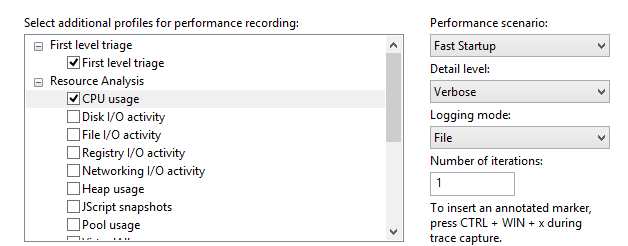

3.  单击**开始**。

4.  输入的路径以保存结果的跟踪，然后单击**保存**。

    -   这将强制系统重新引导来收集和保存跟踪。

5.  系统重启后，等待 5 分钟，以便跟踪来完成。

现在，您有一个跟踪，可以使用**Windows 性能分析器 (WPA)**进行分析。

## 使用 WPA 步骤 2︰ 打开快速启动跟踪

1.  从 「 开始 」 菜单打开**Windows 性能分析器 (WPA)** 。

2.  从**文件**菜单打开您在步骤 1 中创建的跟踪。

3.  打开**配置文件**菜单，然后单击**应用...**

    1.  单击**浏览目录...**

    2.  选择**FastStartup.wpaprofile**。

    3.  单击**打开。**

现在已经通过以下方法使可视化配置文件应用到跟踪以获得一些常用的图形 (CPU、 磁盘等)。

## 第 3 步︰ 可视化活动日程表

1.  看一看**深入的分析**选项卡中的**感兴趣的区域**图

    -   此视图提供的时间线概述在练习 1 中提到的所有**快速启动**子阶段。

        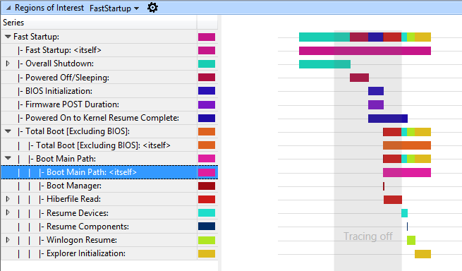

2.  将鼠标悬停在地区条上会导致弹出窗口显示，并提供区域本身的详细信息。

    -   如果将鼠标放在**启动主路径**区域后，您可以看到其持续时间。 在下面的示例中，它持续 13.6 秒。

        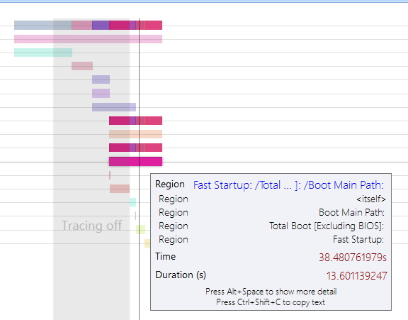

花些时间浏览区域路径树中，并看一看自己熟悉它的所有子阶段。

**资源管理器**初始化数据和完成所需的时间是创建 Windows 桌面，并使用户可以看到所需的时间。 这一阶段 （和一切发生之后，称为**开/关开机自检**） 会受到启动时启动的进程。

选择从资源管理器初始化开头 90 第二个时间间隔并放大。

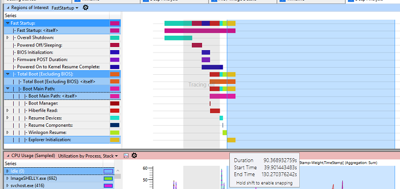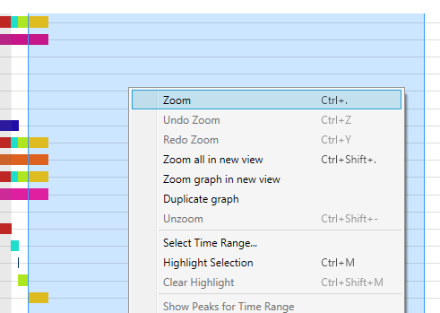

在**感兴趣的地区**图中下, 有两个其他重要图表: **（取样） 的 CPU 使用率**和**磁盘使用率**。 它们将用于评估软件预加载已**过帐开/关**资源消耗和响应能力的影响。

应用程序和服务的 CPU 使用率过高可导致较差的用户体验，例如用户界面停止响应或视频和声音的故障。 当一个进程使用 CPU 过多时，因为他们必须占用系统资源，可以延迟其他进程。

当一个线程使用存储资源时，它可以增加活动的持续时间。 当多个线程争用的存储，从而使用随机磁盘搜索进行延迟更重大。

## 步骤 4︰ 分析进程的 CPU 使用率

为了评估多少 CPU 时间消耗的一个过程，重点放在**（取样） 的 CPU 使用率**图表。 **CPU 使用状况 （式采样）**图中显示的数据表示的 CPU 活动，采取定期 1 样本采样间隔中的毫秒。 表中的每一行表示一个样品。

样本之间发生任何 CPU 活动不会记录此采样方法。 因此， **CPU 采样**图形中没有很好地表示非常短的持续时间，例如中断的活动。

检查以确定具有最高的 CPU 利用率 （**体重**和**重量 %**） 的过程的每个进程的 CPU 使用量。 要做到这一点，向下滚动到关系图**（取样） 的 CPU 使用率**。 在左边，查看过程的列表。 左边显示在关系图选择每个活动进程。

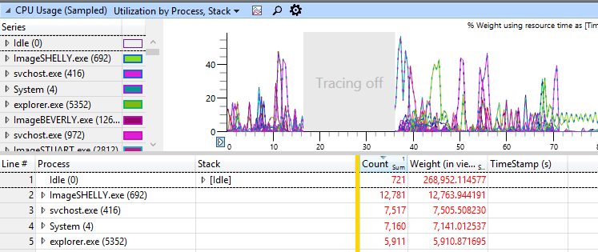

**提示︰**

在使用**WPA**关系图时，您可以更改视图以显示关系图和表。 您可以单击**最大化**按钮以隐藏在**分析**选项卡上显示的其他关系图。

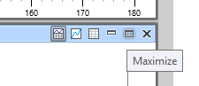

在此示例中， **ImageSHELLY.exe**的当前分析 90 秒的时间间隔在消耗 12.4 秒的 CPU 时间。 由于两个内核的 CPU 在此系统上，这表示相对占 6.9%的利用率。

使用此信息，可以研究导致此 CPU 带宽使用，特定进程或将这些详细信息转发给拥有该过程的开发人员。

您可以添加其他列中提取 （表列表头上单击鼠标右键） 的详细信息︰

-   **线程 ID**︰ 造成 CPU 使用率的线程标识符

-   **堆栈**︰ 调用堆栈中突出显示的代码路径和导致 CPU 使用率的函数

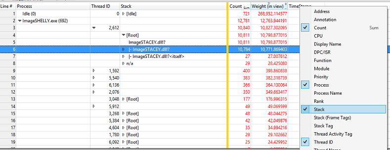

在上面的示例中，是引起大部分在**ImageSHELLY.exe**进程的 CPU 使用率只有一个线程︰ 线程 2612，CPU 活动的 10.77 秒。

堆栈显示此活动来自**ImageSTACEY.dll**模块。

## 步骤 5︰ 分析过程的磁盘使用情况

为了评估多少磁盘**磁盘使用情况**关系图上的焦点，进程占用的带宽。

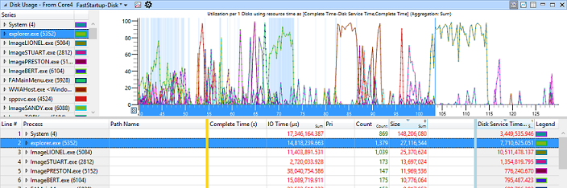

感兴趣的列有︰

-   **Pri**︰ 磁盘 I/O 的优先级。 三个可能的优先级是︰ 正常、 低和非常低。

-   **IO 类型**︰ I/O 类型。 有三种可能的 I/O 类型︰ 读取、 写入和清除。

-   **过程**︰ 创建磁盘 I/O 的进程的标识符。

-   **路径树**︰ 结构化的树，它表示由 I/O 访问文件的位置。

-   **大小**︰ I/O 大小 （以字节为单位）。

-   **磁盘服务时间**︰ 磁盘 I/O 提供服务所需的时间量。

-   **IO 时间**︰ Windows I/O 队列中的 I/O 所花费的时间量。

    -   因为 I/O 可以排队等待，当磁盘争用或高优先级 I/O 调度程序必须首先完成时， **IO 时间**总是比**磁盘服务时间**长。

将这些列添加并排列来获取此视图︰

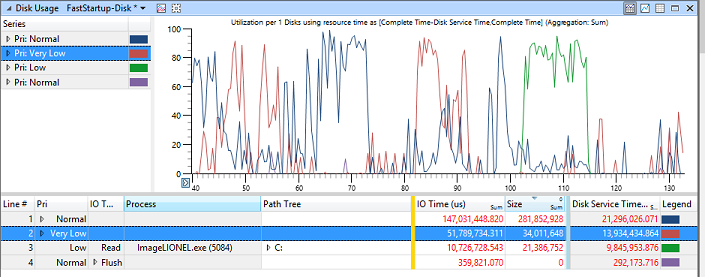

**打开/关闭的公告**只考虑客户正常优先级 I/o。 调查这些磁盘读取从进程有关的信息。 磁盘读取通常更多的磁盘访问时间的帐户不是磁盘上启动，将以大量的数据必须从磁盘中读取启动进程和服务。

1.  单击颜色标记旁边**Pri**︰ 非常低和**Pri**︰ 低系列，以便在图表上可见正常优先级 I/o。

    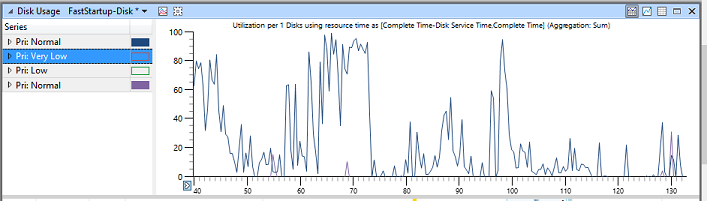

2.  在表视图中，展开**正常**优先级的行。

3.  在表视图中，**编写**、**阅读**、 和**刷新**，请展开行，然后单击**大小**列进行排序按递减顺序排列内容的标题。

    您的屏幕应该类似于这样︰

    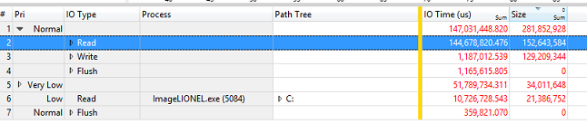

    前面的示例中显示以下信息︰

    1.  从普通磁盘读取 152 MB 的数据。

    2.  129 MB 的数据写入磁盘以普通优先级。

        -   这些都是保持在存储捕获的 ETL 跟踪文件的主要磁盘写入。

4.  在表视图中，展开**读 IO 类型**行。

    -   您现在应该能够看到**开/关开机自检**期间造成最大的读磁盘 I/O 的进程。

5.  确定前三个类别进程，导致磁盘读取并不是 Windows 组件。

    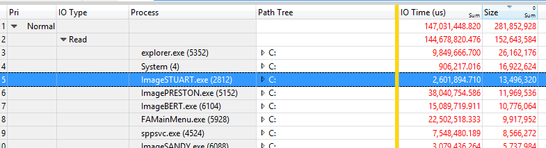

6.  在表视图中，展开**路径树**行的**ImageSTUART.exe**，并在其中导航。

    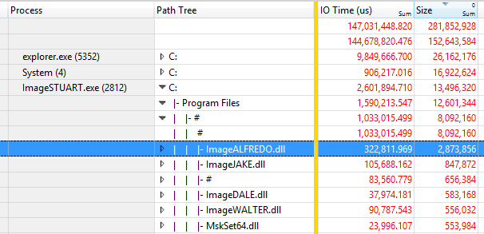

在前面的示例中， **ImageSTUART.exe**从磁盘**打开/关闭后**，在启动时读取的数据高达 13.5 MB，并且大部分访问读取**程序文件**文件夹中的 DLL 组件。

使用此信息，软件开发人员应确定其组件和流程，并确定是否可以减少部分的大小，或者是否可以启动代码路径进行优化，才能从磁盘中读取的数据量最小。

您可以使用此数据来标识启动启动并导致较高的磁盘使用情况的第三方进程。 如果一个进程似乎要引入磁盘争用情况，然后将其从图像中删除或只是不在引导时启动。

 

 

