# 练习 3-了解关键路径分析等

可意外延迟方案和活动。 例如，打开 Microsoft 边缘中的一个选项卡可能有时需要比预期更长的时间。

活动定义为一系列操作，一些连续和一些并行，流向从开始事件结束事件。 在跟踪中任何的开始/结束事件对可被视为活动。 关键路径就是通过这一系列的操作的最长路径。 减少直接关键路径上的任何操作期间会减少总体活动的持续时间。

建议您确定进程和线程的已完成活动，并向后从工作时间完成的活动。 通过分析已完成的活动，以确定该线程如何花费大部分的时间和处于何种状态的线程的开始︰**运行**、**准备好**，或**等待**。

巨大的运行时间指示直接 CPU 使用率可能会造成关键路径的持续时间。 **就绪**状态所用的时间指示其他线程参与关键路径的持续时间，防止关键路径上的线程执行。 花费时间**等待**I/O 点，计时器，或其他线程和进程在等待当前线程的关键路径上。

每个经过的当前线程的线程是关键路径中的可能另一个链接，直到关键路径的持续时间考虑到还可以进行分析。

在**CPU 使用率 （精密）**关系图和表在**WPA**记录所需的所有信息。 记录的调度程序的 CPU 使用率事件是与上下文切换。 重点介绍**NewThread**的交换中，线程此表，每一行代表上下文切换。 数据收集的以下事件序列︰

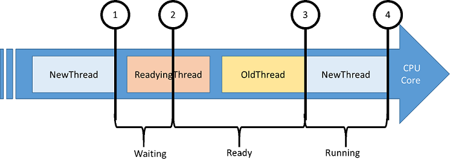

1.  **NewThread**是因为阻塞函数调用切换出。

2.  **NewThread**是由准备好按 readying 线程运行。

3.  **NewThread**交换，从而出旧线程切换。

4.  **NewThread**正再次切换出。

以下是**CPU 使用率 （精密）**表中的有趣的列。

| 列               | 详细信息                                                                                                                                                     |
|----------------------|-------------------------------------------------------------------------------------------------------------------------------------------------------------|
| **CPU 使用情况**      | 新线程切换后的 CPU 使用率。 此值表示在当前可见时间段的总 CPU 时间的百分比。 |
| **计数**            | 该行所表示的上下文切换次数。 这始终是用于单个行 1。                                                       |
| **CPU 使用状况 （毫秒）**   | 新线程上下文切换后的 CPU 使用率。                                                                                                   |
| **NewProcess**       | 新线程的过程。                                                                                                                              |
| **NewThreadId**      | 新线程的线程 ID。                                                                                                                            |
| **NewThreadStack**   | 当切换进新线程的堆栈。 通常表示该线程的已阻止或在等候。                                            |
| **Ready(s)**         | （由于 pre-emption 或 CPU 挨饿） 就绪队列中的线程所用的时间。                                                                   |
| **ReadyingThreadId** | Readying 线程的线程 ID。                                                                                                                       |
| **ReadyingProcess**  | 拥有 readying 线程的进程。                                                                                                                  |
| **ReadyThreadStack** | Readying 的线程的堆栈。                                                                                                                           |
| **ReadyTime (s)**    | 当新的线程已就绪的时间。                                                                                                                   |
| **SwitchInTime(s)**  | 新线程在被切换时的时间。                                                                                                               |
| **等待 (s)**        | 一段时间的逻辑或物理资源上等待的线程。 在等待结束时由**ReadyingThreadId** **NewThreadId**发出信号。               |

 

## 步骤 1︰ 捕获并打开 UI 的延迟问题跟踪

本练习将虚拟进程无响应的用户界面焦点。 该进程是一个简单的 Windows 窗体应用程序具有一个按钮和一个文本框。 当单击按钮时，用户界面变得没有反应更新文本框之前的 20 秒。 将分析该操作的关键路径。

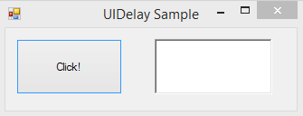

1.  从[此处](http://download.microsoft.com/download/9/C/5/9C562A35-2E52-4CAE-A662-753486C13F4A/UIDelay.exe)下载**UIDelay.exe** 。

2.  启动**UIDelay.exe**。

3.  从**「 开始 」**菜单打开**WPR** 。

4.  修改跟踪配置。

    1.  选择**第一层会审**和**CPU 使用率**。

    2.  作为性能情况下，选择**常规**。

    3.  选择**详细**作为详细信息级别。

        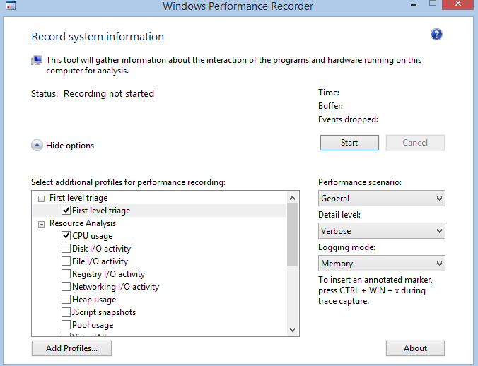

5.  单击**开始**。

6.  在**UIDelay.exe**，请单击**单击**按钮。

    -   等待，直到在文本框中显示"完成 ！"

7.  在**WPR**，保存跟踪，并打开其与**WPA。**

8.  打开**跟踪**菜单中，选择**配置符号路径**。

    -   指定符号高速缓存的路径。 符号的详细信息，请参阅 MSDN 上的[符号支持](https://go.microsoft.com/fwlink/?linkid=623019)页。

9.  打开**跟踪**菜单中，选择**加载符号**。

## 步骤 2︰ 标识延迟的 UI 线程

执行关键路径分析之前, 必须首先确定活动开始和停止事件。

1.  **图形资源管理器中**的**系统活动**节点中查找图形**用户界面的延迟**。

    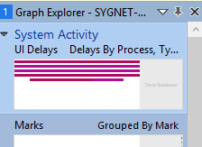

2.  拖放在分析选项卡中的图形**用户界面的延迟**。

3.  发现**UIDelay.exe**过程。

    1.  应为其持续时间约 20 秒。 这表明，没有**UIDelay.exe**的 UI 线程上的 20 秒钟的延迟。

    2.  **线程 Id**列中显示的 UI 线程标识符。 在此示例中，它是 24174。 此值将的跟踪已捕获您的计算机的不同。 请务必注意线程 id。

        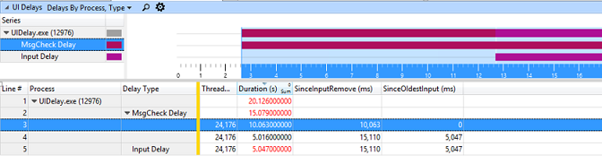

4.  选择整个**UIDelay.exe**的时间间隔，用鼠标右键单击并放大。

    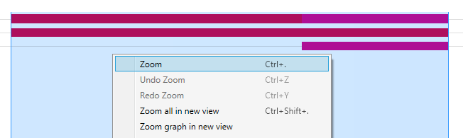

始终应放大您要分析的区域。 它减少了不相关的活动由引入的噪音量。

## 步骤 3︰ 分析 UI 延迟关键路径

现在，您已经使用的线程 ID 和时间戳的起始点的分析，您可以开始很快找到它们到活动关键路径，以了解导致 20 秒钟的延迟，在 UI 线程的事件的顺序。

**NewThreadId**的这一步是在第 2 步 （ **UIDelay.exe**进程中的线程 24174） 中确定的线程。

1.  将**CPU 使用率 （精密）**关系图添加到**分析**选项卡，应用**进程，线程的利用率**预设。

    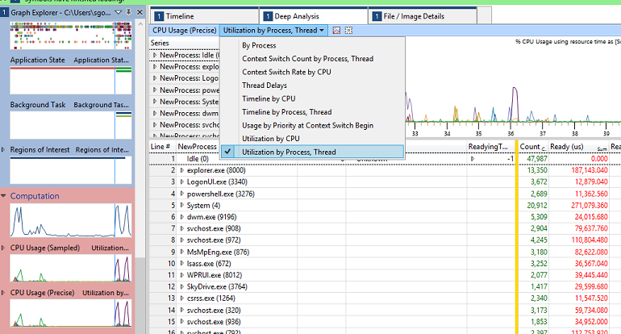

2.  用鼠标右键单击列标题，并使**NewThreadStack**、 **ReadyThreadStack**和**CPU 使用率 (ms)**列可见。

3.  删除**准备就绪 （美国）\[最大\]**和**（我们） 将等待\[最大\]**列。 您的视区现在应该如下所示。

    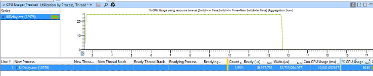

4.  并扩展**UIDelay.exe**进程，将**NewProcess**列中的查找与排序**等待 （美国）\[合计\]**通过单击列标题。

5.  **NewThreadId**在**UIDelay.exe**过程中，搜索并分析其运行，已准备好或等待状态所用的时间。

    -   在以下示例中，您可以发现︰

        -   线程正在使用的 CPU 时间 10.025 秒。

        -   线程正在等待 5.159 秒。

        -   线程可以忽略不计的一段时间处于就绪状态 (10ms)。

        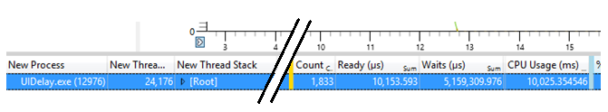

    **请注意**  
    您可以分析 CPU 活动使用同一方法在练习 2 中，使用**CPU 使用率 （取样）**关系图并查看**UIDelay.exe**进程第 4 步所述 10 秒钟。

     

6.  发现**NewThreadId**正在等待，展开以显示**NewThreadStack**的**NewThreadId**组。

7.  展开**\[根\]**，并确定导致等待函数调用。

    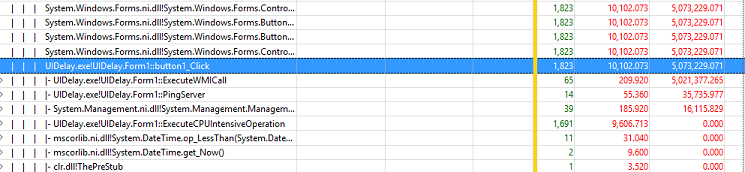

在此示例中， **UIDelay.exe**线程 ID 24174 等待 5.073 秒时该按钮单击函数基础阻塞函数调用时将触发︰

-   由于操作下的**ExecuteWMICall**函数是 5.021 秒。

-   35 的 ms 是由于下面的**PingServer**函数的操作。

### ExecuteWMICall 代码路径的步骤 3.1︰ 看

如果展开进一步下**ExecuteWMICall**的调用堆栈，就会发现，UI 线程正在实际上休眠 5 秒钟通过显式调用**Thread.Sleep**。

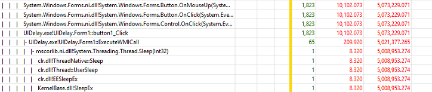

应避免这种行为根本成本，因为它直接影响了响应速度。 如果代码需要等待的时间信息，它应在单独的线程上异步执行它并使用事件驱动方法。

## PingServer 代码步骤 3.2︰ 查看

如果您展开进一步下**PingServer**的调用堆栈，就会发现 UI 线程具有 I/O 依赖项，因为它在网络上发送**Ping**命令。

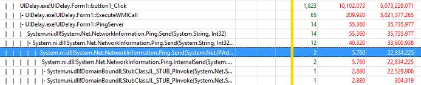

虽然非常小的延迟时间是 （35 毫秒），应避免使用在 UI 线程上。 请记住，一般人会注意到任何 UI 延迟大于 100 毫秒。 此操作可能会增加超过 100 毫秒，从而导致有坏感觉的响应性的用户活动总运行时间。

这些操作应在单独的线程上异步发生并不会阻止用户界面。

 

 

