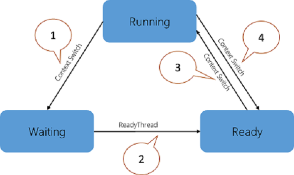

# 优化性能和响应能力

客户期望高绩效并快速响应系统。 这涵盖广泛范围的情况下--从启动时间到流畅的用户与应用程序交互。 分析性能问题需要大量的专业技术和特定于域的知识。 Microsoft 提供的工具可帮助您应对这种复杂任务。

本指南向您介绍的过程测量，分析，和关键领域中的性能问题的解决根本原因。 包括以下主题︰

-   使用**Windows 性能 Toolkit (WPT)**

-   捕获的事件跟踪日志 (ETL) 跟踪

-   引导、 应用程序启动和 UI 延迟

-   CPU 和磁盘资源使用率分析

-   关键路径和等待分析

## 目标

本指南将向您展示如何执行以下任务︰

-   收集相关数据，分析在任何系统上的性能问题

-   了解一下如 CPU 和磁盘的系统资源消耗分析过程

-   确定什么可以影响某些 Windows 场景中的系统响应

## 工具

在 ADK Windows 评估 Toolkit 提供一组称为评估与性能相关的测试。 评估结果用于诊断潜在问题，这样的硬件和软件开发都响应能力且有电池寿命、 启动性能和关闭时间的影响最小。 相同的评估可供 OEM/ISV/IHV 合作伙伴、 爱好者和社区，建立一种通用的框架来衡量、 比较，并审查的质量方面的其他成员。

**Windows 性能 Toolkit**包含两个独立的工具︰ **Windows 性能记录器 (WPR)**和**Windows 性能分析器 (WPA)**。 **WPR**是一个功能强大的记录工具，创建跟踪 Windows 事件 (ETW) 录制。 您可以从用户界面 (UI) 或命令行 (CL) 运行**WPR** 。 **WPR**提供内置的配置文件，可以用来选择您想要记录的事件。 **WPA**是一种功能强大的分析工具，结合丰富的图形功能灵活的用户界面和数据表格来可以透视并具有全文搜索功能。

## 快速启动行为

在 Windows 8 中引入，快速启动是缺省的引导行为。 关机过程经过更新，包括将数据写入到磁盘镜像如何休眠工作的方式。 启动过程中，系统就可以执行下表中描述的阶段。

| 阶段                       | 说明                                                                                                                                                  |
|-----------------------------|--------------------------------------------------------------------------------------------------------------------------------------------------------------|
| **BIOS 初始化**     | 时，操作系统会初始化 BIOS，包括预启动执行环境 (PXE)。                                              |
| **读后**          | 从磁盘中读取后操作系统所用的时间。 后包含所有的系统上下文在关机过程中写入。            |
| **恢复设备**          | 时，操作系统会以恢复设备并将它们放回中的当前电源状态。                                                           |
| **WinLogon 简历**         | 操作系统继续 Winlogon 进程所用的时间。                                                                                          |
| **资源管理器初始化** | 时，操作系统会初始化 Windows 外壳程序 (explorer.exe)。 这一阶段结束时向用户显示桌面或开始屏幕。 |
| **开机自检打开/关闭持续时间**    | 桌面上出现之后，但直到变为空闲的 CPU 和磁盘资源完成所有启动任务所需的时间窗口。                                 |

 

快速启动行为有关的详细信息，请参阅 MSDN 上的[开/关切换性能](http://go.microsoft.com/fwlink/p/?linkid=619168)主题。

## CPU 调度和线程

系统中处理器的数量是有限的因为无法在同一时间运行的所有线程。 Windows 实现处理器分时，它允许线程运行一段时间之前切换到另一个线程的处理器。 线程间切换的法案称为上下文切换，通过一个称为调度程序的 Windows 组件。 每个线程在任何给定时间位于一个特定的执行状态。 Windows 使用与性能相关的三种状态︰**运行**、**准备就绪**和**等待**。

正在执行的线程都处于**运行**状态。 线程可以执行，但当前没有运行，处于**就绪**状态。 （因为它们在等待特定事件） 不能运行的线程处于**等待**状态。 下图说明了可能的线程转换。

1.  在**运行**状态中的线程通过调用**WaitForSingleObject**函数等待启动转换到**等待**状态或**睡眠 (&gt; 0)**。

2.  在正在运行的线程或内核操作让一个线程处于**等待**状态 （例如， **SetEvent**或计时器过期）。

3.  正在运行的线程在等待，或执行其量程结束时，处于**就绪**状态的线程调度程序安排处理中。

4.  处于**运行**状态的线程切换出并放入**就绪**状态的调度程序或其量程结束时它正在通过更高优先级的线程抢占。

仅当用户正在等待的线程来完成某项操作时，线程状态将成为性能的重要因素。

CPU 调度有关的详细信息，请参阅 MSDN 上的[CPU 分析](http://go.microsoft.com/fwlink/p/?linkid=619178)主题。

## 练习

本指南包括以下练习。

-   [练习 1 – 评估使用评估 Toolkit 的快速启动](optimizing-performance-and-responsiveness-exercise-1.md)

-   [练习 2-评估使用 Windows 性能 Toolkit 的快速启动](optimizing-performance-and-responsiveness-exercise-2.md)

-   [练习 3-了解关键路径分析等](optimizing-performance-and-responsiveness-exercise-3.md)

 

 

