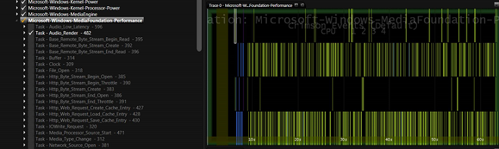
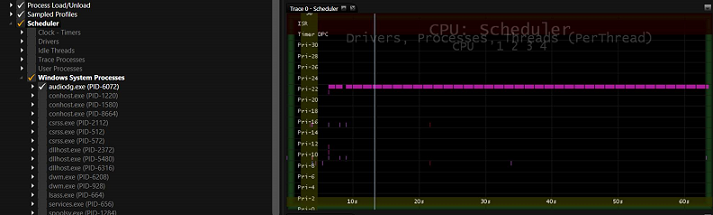
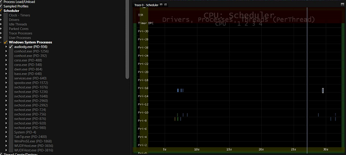

# <a name="exercise-3---use-mxa-to-verify-that-audio-is-offloaded-during-full-screen-video-playback"></a>验证音频练习 3-使用 MXA 是下放期间全屏幕视频回放


将卸载芯片组的音频处理支持音频将导致更长的电池寿命下放期间利用媒体引擎 Windows 中的音频和音频/视频播放方案。 本练习使用**媒体体验分析器 (MXA)**工具来确定音频被下放到硬件在全屏视频回放过程中。

## <a name="step-1-load-an-etw-trace-that-was-captured-during-full-screen-video-playback"></a>步骤 1︰ 负载全屏视频播放期间捕获 ETW 跟踪


1.  安装**MXA**可以下载[这里](https://go.microsoft.com/fwlink/?linkid=525711)。

2.  用鼠标右键单击**开始**菜单，然后单击**命令提示符 （管理员）**。

3.  导航到安装**MXA**位置的文件夹。

4.  下载**AudioNotOffloaded.etl** [在此处](http://download.microsoft.com/download/A/5/D/A5D6F588-EE12-4FBA-B54C-E6D1E554F19C/AudioNotOffloaded.etl)。

5.  运行以下命令︰

    ``` syntax
    xa -i <AudioNotOffloaded.etl location>\AudioNotOffloaded.etl
    ```

    例如，如果您下载到 c: **AudioNotOffloaded.etl** \\性能\\媒体\\，可键入以下命令︰

    ``` syntax
    xa -i C:\Performance\Media\AudioOffload\AudioNotOffloaded.etl
    ```

6.  按**关闭符号**按钮以关闭查找符号。

## <a name="step-2-verify-audio-was-rendered-when-the-etw-trace-was-collected"></a>第 2 步︰ 验证音频呈现时收集 ETW 跟踪


1.  加载跟踪，一旦拖放到面板的**Microsoft Windows MediaFoundation 性能**提供程序。

2.  通过单击此数据集旁边的复选框两次取消选择**Microsoft Windows MediaFoundation 性能**提供程序中的所有事件。

3.  启用**任务音频\_呈现 – 482 事件**。

4.  如果您的音频呈现在跟踪整个触发事件、 收集跟踪时播放音频。



我们可以看到在上面的抓图中，音频呈现**Microsoft Windows MediaFoundation 性能**提供程序中的事件 (**音频任务\_呈现 – 482**) 在整个的跟踪记录。 这将验证该音频播放。

## <a name="step-3-determine-whether-audio-was-offloaded-to-hardware"></a>步骤 3︰ 确定音频是否被下放到硬件


1.  拖放到面板的**CPU 调度**数据集。

2.  两次单击**CPU 调度程序**数据集的根处的复选框，取消选中所有事件。

3.  展开数据集**CPU 调度程序**和**Windows 系统进程**节点。

4.  通过一次单击复选框选择**audiodg.exe**进程。

5.  如果不卸载音频则发生在整个播放会话，每隔 10 毫秒的**audiodg.exe**线程活动。 有关示例，请参见 MXA 屏幕抓图\#1。

6.  如果没有**audiodg.exe**线程活动仅在启动和关闭，然后音频是被下放。 有关示例，请参见 MXA 屏幕抓图\#2。

7.  下载**AudioOffloaded.etl**跟踪文件[此处](http://download.microsoft.com/download/7/A/9/7A9935AE-DD3C-4714-9457-FF86BD5A6F05/AudioOffloaded.etl)。

8.  重复步骤 1、 2 和 3，而不**AudioNotOffloaded.etl**使用**AudioOffloaded.etl**跟踪。

### <a name="a-href-idmxa-screenshot--1--trace-taken-on-a-system-where-audio-is-not-being-offloadedamxa-screenshot-1-trace-taken-on-a-system-where-audio-is-not-being-offloaded"></a><a href="" id="mxa-screenshot--1--trace-taken-on-a-system-where-audio-is-not-being-offloaded"></a>MXA 屏幕抓图\#1︰ 不被卸载音频系统上进行跟踪

请注意**audiodg.exe**唤醒每个 10ms 来处理在整个跟踪整个音频样本。



### <a name="a-href-idmxa-screenshot--2--trace-taken-on-a-system-where-audio-is-being-offloadedamxa-screenshot-2-trace-taken-on-a-system-where-audio-is-being-offloaded"></a><a href="" id="mxa-screenshot--2--trace-taken-on-a-system-where-audio-is-being-offloaded"></a>MXA 屏幕抓图\#2︰ 正在卸载音频都会在系统上进行跟踪

请注意，在启动和关闭阶段播放存在**audiodg.exe**进程中的非常低的线程活动。 此外请注意在稳态过程中没有任何线程活动。



 

 


