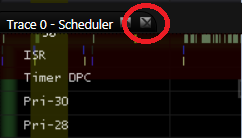
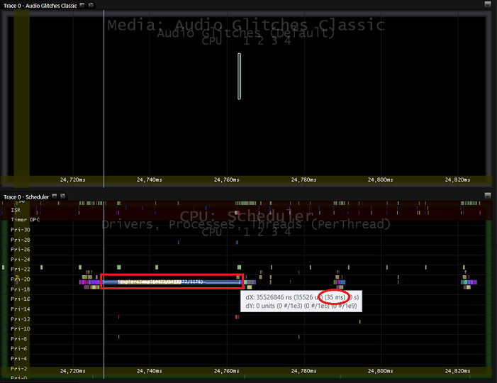
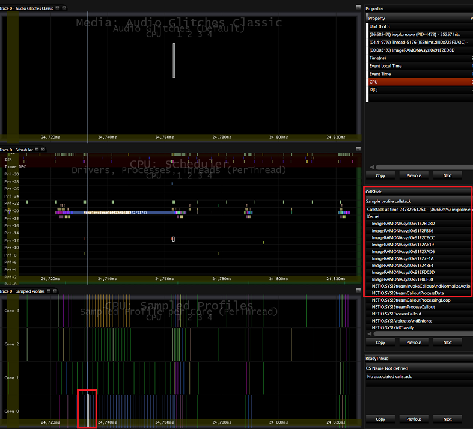

# <a name="exercise-4---use-mxa-to-analyze-audio-glitches"></a>练习 4-MXA 用于分析的音频故障


在此实验室中，您将分析音频故障。 音频故障通常是由下列问题之一导致的︰

-   延迟过程调用 (DPC) 或中断服务例程 (ISR) 运行超过 1 毫秒。

-   驱动程序或内核线程在运行的派单级别 1 毫秒或更长时间。

-   不能从磁盘读取数据或网络不是不够快，因为磁盘或网络利用率高。

-   硬件或软件解码器无法解码并更快地实时处理流。

## <a name="step-1-open-the-trace-in-mxa-and-drag-the-pertinent-datasets-into-panels"></a>步骤 1︰ 在 MXA 打开跟踪，并将相关数据集拖动到面板


1.  安装**媒体体验分析器 (MXA)**可以下载[这里](https://go.microsoft.com/fwlink/?linkid=525711)。

2.  用鼠标右键单击**开始**菜单，然后单击**命令提示符 （管理员）**。

3.  导航到安装**MXA**位置的文件夹。

4.  在您的计算机上设置**MXA**符号路径。

5.  下载**AudioGlitches\_ThreadsAtDispatchLevel.etl**从[此处](http://download.microsoft.com/download/9/6/0/96000C33-FB05-44B7-96A1-9C0CF5EE865B/AudioGlitches_ThreadsAtDispatchLevel.etl)。

6.  打开**AudioGlitches\_ThreadsAtDispatchLevel.etl**跟踪文件中键入以下命令︰

    ``` syntax
    xa.exe -i <AudioGlitches_ThreadsAtDispatchLevel.etl location>\AudioGlitches_ThreadsAtDispatchLevel.etl
    ```

    例如，如果您下载了**AudioGlitches\_ThreadsAtDispatchLevel.etl**为 c:\\性能\\介质，可键入下面的命令︰

    ``` syntax
    xa.exe -i C:\Performance\Media\AudioGlitches_ThreadsAtDispatchLevel.etl
    ```

7.  在**MXA**初始屏幕上，按**关闭符号**按钮以关闭查找符号。

    

8.  一旦加载跟踪时，请关闭任何打开的面板，按每个面板的名称旁边的小 X 出现在应用程序的中心。

9.  添加 3 新面板。 单击**视图** &gt; **新的面板**或按**CTRL + N**。

10. 拖放到前面板**音频失灵经典**数据集在**介质**节点下。

11. 拖放到第二个面板从顶部节点下的**CPU** **调度**数据集。

12. 拖放到第三个面板顶部的**CPU**节点下的**采样配置文件**数据集。

13. 筛选出视图的空闲进程，以便您可以更清楚地看到其他线程活动。 在数据集树中，展开**CPU**节点中的**计划**数据集，然后单击**空闲线程**节点复选框两次以取消选择。 一次单击复选框突出显示在关系图; 数据两次单击取消选择它。

## <a name="step-2-identify-the-region-of-the-trace-where-an-audio-glitch-occurred"></a>步骤 2︰ 标识跟踪的音频故障发生位置的区域


您可以查看音频引擎数据看到这些故障发生时的可视时间线和比较线到其它数据集以查找模式将事件跟踪日志 (.etl) 文件中。

1.  通过单击并拖动鼠标在一个在顶部面板**音频失灵经典**条放大音频故障。

2.  请注意， **iexplore.exe**进程**调度程序**集中的第二个面板中运行音频故障之前很长时间 (大约 20-35ms)。

3.  按 esc 以缩小 100%，然后重复前面的两个步骤以验证模式，长时间运行**iexplore.exe**进程 (~ 20 35 毫秒) 之前每个音频故障。

4.  测量时间与面板中的，按住**SHIFT**键的同时将鼠标从**iexplore.exe**进程栏的一端拖到另。 鼠标光标通过工具提示显示在时间轴上测定的毫秒数。 在下面的**MXA**屏幕截图，大约 35 毫秒运行进程。

    

## <a name="step-3-identify-the-cause-of-the-delays-in-the-pipeline"></a>步骤 3︰ 确定管道中的延迟的原因


前此音频的小故障，一个内核上运行长时间运行**iexplore.exe**进程。 若要了解如何**iexplore.exe**线程被阻塞的音频的管道，可以看**CPU**节点中的对应**采样配置文件**数据集。

1.  如果**调用堆栈**dataviewer **MXA**窗口中不可见，请单击**查看** &gt; **数据查看器** &gt; **调用堆栈**，以将其打开。

2.  在**采样配置文件**面板 （从顶部第三个） 中，将鼠标悬停在匹配的长时间运行的**iexplore.exe**线程相同颜色的示例配置文件事件。

3.  **调用堆栈**窗口中显示每个样本的调用堆栈。 在运行特定的驱动程序， **ImageRAMONA.sys**， **iexplore.exe**的大部分核心中的示例上悬停时位于**调用堆栈**顶部的注意。

4.  尽管**audiodg.exe**线程正在运行高优先级 （优先级 22） 比**iexplore.exe**线程 （优先级 19）， **iexplore.exe**线程调用插入驱动程序 (**ImageRAMONA.sys**)，从而引发 IRQL 级别的处理器。 因此， **audiodg.exe**，它的调度程序保留 DPC 正在等待没有机会对其常规的 10ms年节奏，从而导致音频故障运行。

5.  按住**SHIFT**键可冻结的**调用堆栈**和**属性数据查看器**，并将鼠标移动到**调用堆栈**。 按**复制**。



 

 


