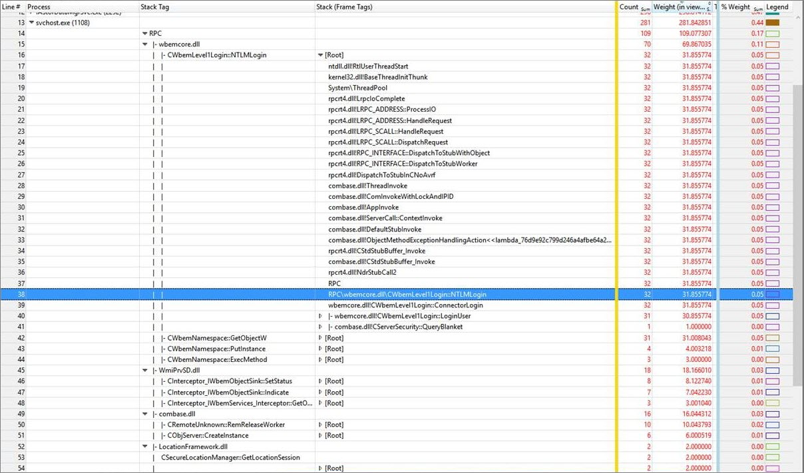

# 堆栈标记

在 Windows® 性能分析器 (WPA) 堆栈标记是一种功能，允许您创建标签 （标签），以帮助您更好地识别调用 stack(s) 中的哪些部分会受到影响。

## 了解堆栈标签和堆栈帧标签之间的差异

可以标记**堆栈 （帧标签）**和**堆栈**看作**堆栈**列中可用的相同数据的两个视图。 您可以配置为一个堆栈标记或堆栈列 （帧标签） 中视图编辑器中查看堆栈列。

调用堆栈包含一个框架的列表。 如果调用堆栈是形式的 A-&gt; B-&gt; C，则会出现三个框架︰ A、 B 和 c。 堆栈列 （帧标签） 将每个调用堆栈帧映射到标记或默认*模块*为 ！*方法*没有标记是否存在。

例如，调用堆栈 A-&gt; B-&gt; C-&gt; D，**堆栈 （帧标签）**视图中可能会变得 A-&gt; FrameTagB-&gt; FrameTagC-&gt; d。每个帧标记可以具有层次结构基于层次结构的标记中定义的\*.stacktags 文件 (例如，FrameTagB 的实际值可以"HTML\\脚本\\OM")。

堆栈标记使用单个标记名称来汇总整个调用堆栈。 例如，底部大多数映射的框架标签通常由堆栈标记除非没有标记为指定的优先级。 使用相同的 A-&gt; B-&gt; C-&gt; D 的示例，其中框架标记视图是 A-&gt; FrameTagB-&gt; FrameTagC-&gt; D，堆栈标记视图只是︰ FrameTagC。

除了普通标记完全匹配的模块和方法，还可以为被调用方或调用方定义 HintTag 与 HintOperator。 例如，为被调用方的 HintOperator 与 HintTag 被为 b。调用堆栈 A-&gt; B-&gt; C-&gt; D **(FrameTags) 堆栈**视图中的可能会变得 A-&gt; FrameTagB-&gt; ModuleOfC-&gt; D 和其 StackTag 视图是 FrameTagB-&gt; ModuleOfC。 作为一个新的堆栈标记动态创建的 C 模块。 显式将 HintTag 的*OnlyShowModule*属性设置为 false 会使 C 作为新堆栈标记，而不是 ModuleOfC。 *OnlyShowModule*属性是默认情况下，则返回 true。 典型用例是自动属性 RPC 服务器功能。 其直接调用方函数是 rpcrt4.dll ！调用\_epilog1\_开始。 您可以定义此常见的调用方函数 HintTag 来实现此目的。

## 通过定义提示标记标识常用功能的成本

通常情况下，**堆栈 Tag**列标识单个函数在单个模块中的成本。 但是，WPA 可以整合成本 ofall 定义*提示标记*和*提示操作员*是否由该函数调用的函数。 提示标记是常用的功能和它所调用的函数的一组标签，提示操作员作为调用函数、*调用方*或被调用的函数中，*调用方*标识的通用函数。

典型用例是定义提示标记，以便 WPA 自动属性 RPC 服务器功能。 您还可能希望定义一个提示标签中，例如，以显示对锁持有者或堆分配函数。

### 定义提示标记

提示标记和提示操作员在 XML 中定义下面的语法使用的属性和值如下表所述。

<pre>
    &lt;HintTag 名 ="<i>字符串标签</i>"优先级 ="<i>整数</i>"HintOperator ="<i>调用方或方</i>"OnlyShowModule ="<i>布尔</i>"&gt;
        &lt;入口点模块 ="<i>模块名称</i>"方法 ="<i>方法名称</i>"/&gt;
    &lt;/HintTag&gt;
</pre>

<table>
<thead>
<tr class="header">
<th>元素</th>
<th>属性</th>
<th>说明</th>
</tr>
</thead>
<tbody>
<tr class="odd">
<th rowspan="4">HintTag</th>
<td><i>名称</i></td>
<td>要作为标签使用的字符串</td>
</tr>
<tr class="even">

<td><i>优先级</i></td>
<td>整数。 默认值为零。</td>
</tr>
<tr class="odd">

<td><i>HintOperator</i></td>
<td>值是&quot;调用方&quot;或&quot;被调用方&quot;调用或分别调用函数。</td>
</tr>
<tr class="even">

<td><i>OnlyShowModule</i></td>
<td>布尔值、 可选。 默认值为 true。</td>
</tr>
<tr class="odd">
<th rowspan="2">入口点</th>
<td><i>模块</i></td>
<td>包含<i>方法</i>的模块的名称。</td>
</tr>
<tr class="even">

<td><i>方法</i></td>
<td>入口点的方法的名称。</td>
</tr>
</tbody>
</table>

若要添加您在 XML 文件中定义的提示标记，请在本主题后面[将堆栈标签添加到堆栈的标记定义文件](#adding-stack-tags-to-the-stack-tags-definition-file)，在使用过程。

### 使用提示标记的示例

请考虑下图中所示的示例数据。

在此示例中，有 4 名为 WbemCore.dll 的 RPC 功能︰

-   **CWbemLevel1Login::NTLMLogin**
-   **CWbemNamespace::GetObjectW**
-   **CWbemNamespace::PutInstance**
-   **CWbemNamespace::ExecMethod**

能够整合成本的调用这些函数可用于确定 RPC 服务器端函数，成本因为 WPA 作为**RPC** **堆栈 Tag**列中显示的总支出。

与**rpcrt4.dll ！调用**函数定义为**RPC**，提示标记的入口点，并提示操作员指定为被调用方，WPA 代表**rpcrt4.dll ！调用** **RPC**，和**wbemcore.dll ！CWbemLevel1Login::NTLMLogin**与**RPC\\wbemcore.dll\\CWbemLevel1Login::NTLMLogin**。 因此，在**堆栈标记**列中，WPA 显示**wbemcore.dll 的费用 ！CWbemLevel1Login::NTLMLogin**的 RPC 服务器端函数，31.855774ms。 在 WbemCore.dll， **NTLMLogin**是 RPC 函数中调用的函数的层次结构的顶部。

**RPC**中的提示标签由下面的 XML 定义。

<pre>
    &lt;HintTag 名 ="RPC"HintOperator ="被调用方"&gt;
        &lt;Module="rpcrt4.dll 入口点"方法 ="调用"/&gt;
    &lt;/HintTag&gt;
</pre>

## 将堆栈标记添加到标记堆栈的定义文件

将堆栈标记定义添加到堆栈标记的定义文件，请执行以下操作︰

1.  在菜单中，选择**跟踪**，然后选择**跟踪属性**。 打开**跟踪属性**选项卡。

2.  在堆栈标记定义区域中，单击**添加**到所需位置。

3.  导航到区域中，其中包含的堆栈标记文件、 选择它，然后单击**打开**。

## 从堆栈标记定义文件删除堆栈标记

若要从堆栈标记定义文件删除堆栈标记定义，请执行以下操作︰

1.  在菜单中，选择**跟踪**，然后选择**跟踪属性**。 打开**跟踪属性**选项卡。

2.  在堆栈标记定义区域中，选择您想要删除，然后单击**删除**堆栈标记定义。

    **警告** 请确保您要删除选定的堆栈标记定义，因为不会取消后单击**删除**选项。

     

## 重新加载堆栈标记定义文件

要重新加载堆栈标记定义标记堆栈的定义文件，请执行以下操作︰

1.  在菜单中，选择**跟踪**，然后选择**跟踪属性**。 打开**跟踪属性**选项卡。

2.  在堆栈标记定义区域中，单击**重新加载**。 您可以通过按住 Shift 键并单击鼠标左键每个堆栈标记定义加载堆栈的多个标签。

## 您的堆栈标记文件疑难解答

调查中在 WPA 堆栈标记文件的问题，请执行以下操作︰

-   在菜单上，单击**窗口**，然后选择**诊断控制台**。 WPA 显示将拆分为两个-**图形浏览器**和屏幕的上半部分中的**分析**和**诊断控制台**底部屏幕大小的一半。

    **提示** 您还可以通过单击**诊断控制台**访问诊断控制台在 WPA 的左下角。 一旦打开，也可以拖出到另一个窗口或将其固定在顶部或侧面。

    诊断控制台列出有关分析工作流过程中发生的异常的信息。 您可以诊断符号解码问题通过此控制台

## 相关的主题

[WPA 用户界面简介](introduction-to-the-wpa-user-interface.md)

[诊断控制台](diagnostic-console.md)

 

 

