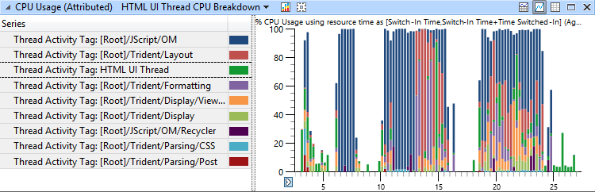
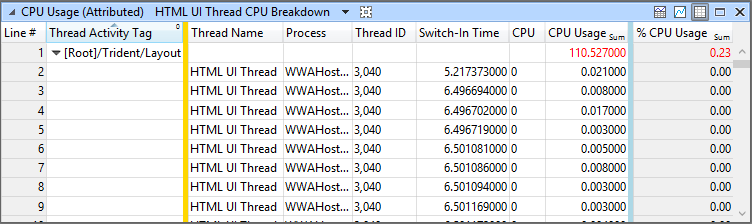
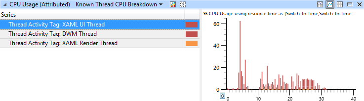

# Windows 应用商店应用程序分析

WPA 现在包括功能，可帮助您分析 Windows 应用商店应用程序性能。 观看下面的简要概述了这些功能的视频︰

<iframe src="https://hubs-video.ssl.catalog.video.msn.com/embed/bf588be3-5aa0-4679-9f00-7dcaa93df127/IA?csid=ux-en-us&MsnPlayerLeadsWith=html&PlaybackMode=Inline&MsnPlayerDisplayShareBar=false&MsnPlayerDisplayInfoButton=false&iframe=true&QualityOverride=HD" width="720" height="405" allowFullScreen="true" frameBorder="0" scrolling="no"></iframe>

[在本视频中，发送反馈或请求新的性能分析视频。](mailto:lhdocfb@microsoft.com?subject=HCKTestLevelsVIDEO&body=%0D%0A%0D%0AMicrosoft%20uses%20your%20feedback%20to%20improve%20its%20products,%20services%20and%20documentation.%20While%20we%20are%20investigating%20the%20issue%20you%20report,%20we%20may%20send%20e-mail%20to%20you%20to%20ask%20for%20further%20details%20or%20clarification%20on%20the%20feedback%20you%20send%20to%20us,%20and%20we%20may%20send%20e-mail%20to%20you%20to%20let%20you%20know%20that%20your%20feedback%20has%20been%20addressed.%C2%A0%20We%20do%20not%20use%20your%20e-mail%20address%20for%20any%20other%20purpose.%0D%0AFor%20technical%20support,%20contact%20http://go.microsoft.com/fwlink/?LinkId=143702.%0D%0A%0D%0A%20For%20further%20information%20about%20the%20Microsoft%20Online%20Privacy%20Statement,%20please%20see%20http://go.microsoft.com/fwlink/?LinkId=143701.)

## Windows 应用商店应用程序配置文件

WPA 包括一组帮助用户加快您的 Windows 应用商店应用程序分析的配置文件。 这些配置文件包含在找您将配置文件应用于打开跟踪**配置文件目录**︰

-   AppLaunch – 适用于应用程序启动分析视图中包含预设。

-   XAMLApplicationAnalysis--包含所有预设和着手分析了基于 XAML 的 Windows 应用商店应用程序所需的视图。

-   HTMLApplicationAnalysis--包含所有预设和分析您的基于 HTML 的 Windows 应用商店应用程序入门所需的视图。

有关配置文件的详细信息，请参阅[查看配置文件](view-profiles.md)。

包括视频，帮助您开始使用 Windows 商店应用程序分析配置文件的详细信息，请参阅以下链接︰

-   [概要信息](big-picture.md)

-   [框架的分析](frame-analysis.md)

## 特性化的 CPU 使用情况

在**特性化 CPU 使用率**图中，CPU 使用率是归因于不同的活动。 例如，可能属于活动的一个部分内容绘制在屏幕上，而另一部分可以归因于处理 JavaScript 代码。 这些标识标记可帮助您更轻松地标识您的应用程序如何花费时间。

由于 CPU 使用率图表包含分解在您的 Windows 应用商店应用程序的 CPU 使用率的下列预设︰

-   DWM 线程 CPU 细分

-   HTML 呈现线程 CPU 细分

-   HTML UI 线程 CPU 细分

-   已知的线程 CPU 细分

-   通过进程，线程活动的利用率

-   XAML 的渲染线程 CPU 细分

-   XAML 用户界面线程 CPU 细分

如果鼠标悬停在图中的栏，您可以看到相应的活动的其他元数据。

在**特性化的 CPU 使用情况**表中，**线程名称**列可帮助您快速识别关键应用程序中的线程。 在下面的屏幕截图，您可以看到**HTML UI 线程**，某些工作**布局**活动期间的命名线程︰

**警告**  
**特性化 CPU 使用量**表依赖于区域内利息定义属性为不同的活动的 CPU 使用率。 使用多个区域文件时，不同地区感兴趣的可以重叠和冲突。 发生这些冲突时，WPA 是无法准确特性在给定的时间范围内给定线程的单个活动。 若要避免这些潜在的冲突，请使用一次只有一个地区定义文件。

 

## 线程命名

Windows 应用商店应用程序使用不同的线程来执行不同类型的工作。 例如，XAML UI 线程将工作传递给呈现线程要绘制到屏幕。 WPA 使用描述性的线程名称来清楚地标识该线程正在执行的操作。 了解哪些表中的多个线程是呈现线程，即 XAML UI 线程使用户能够看到的行为，特别是在线程间的特定模式。

上面的图像显示从 XAML 用户界面的活动线程和 XAML 呈现线程，桌面窗口管理器 (DWM) 线程。

 

 

