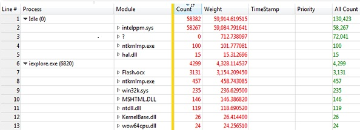

# WPA 查询语法

语法搜索和过滤组件的 Windows 性能分析器 (WPA) 是 Windows 查询语法的扩展。 有关详细信息，请参阅[高级查询语法](http://go.microsoft.com/fwlink/p/?linkid=229849)。

## 可用的扩展

下表描述了可用的扩展。

<table>
<colgroup>
<col width="50%" />
<col width="50%" />
</colgroup>
<thead>
<tr class="header">
<th>说明</th>
<th>示例</th>
</tr>
</thead>
<tbody>
<tr class="odd">
<td>
如果空格或字符括在方括号中，属性名称可以包含空格和其他非字母数字字符。
</td>
<td>
<code>[All Count]:&gt;0</code>

<code>[% Weight]:= 5.6</code>
</td>
</tr>
<tr class="even">
<td>
字符串类型允许<strong>正则表达式</strong>运算符 （*） 星号。
</td>
<td>
下面的查询匹配<em>iexplore</em>和<em>资源管理器中</em>，但不是<em>myexplorer</em>:

<code>ProcessName:* '.?explore.*'</code>
</td>
</tr>
<tr class="odd">
<td>
内存大小后缀 （KB、 MB、 GB） 和时间单位 (s，ms，我们 ns) 上双和整数支持文本。 这些后缀是不区分大小写。
</td>
<td>
<code>Size :&gt; 20MB AND Size :&lt; 0.5GB</code>

<code>Duration :&gt; 5ms OR Duration :&lt; 1us</code>
</td>
</tr>
<tr class="even">
<td>
支持灵活精度相等运算的浮动文本。 精度取决于查询中包含的十进制数字的数量。
</td>
<td>
<code>Duration := 4.5ms</code> 有可能产生较大的结果集比<code>Duration :=4.50ms</code>。
</td>
</tr>
</tbody>
</table>

 

您可以限制搜索范围的行的子集︰ 系列名称。 系列名称是左侧的金色栏最右边的非空列的名称。 在下面的表中，行 1-6 系列名称是*过程*。 对于所有其他行中，系列名称是*模块*。

如果查询的`Process:~='iexplore'`，选择行 6-13。

如果查询的`Process:~='iexplore' AND [Series Name] := 'Process'`，选择仅行 6。

如果查询的`Process:~'iexplore' AND [Series Name] := 'Module'`，选择 7-13 行。

## 相关的主题

[WPA 功能](wpa-features.md)

 

 

