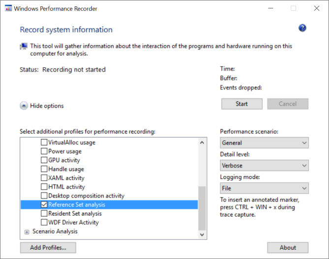
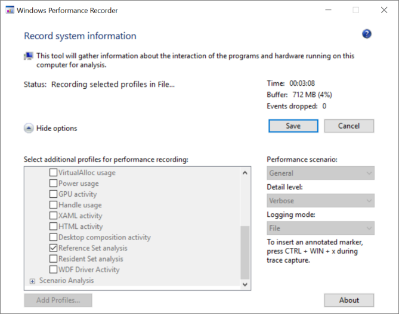
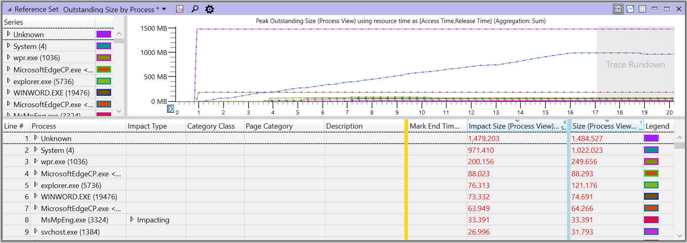
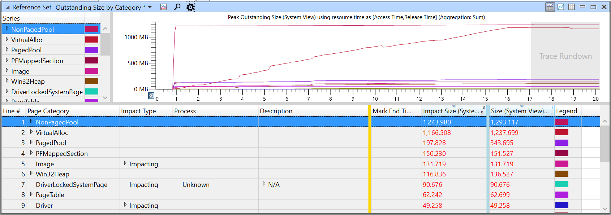
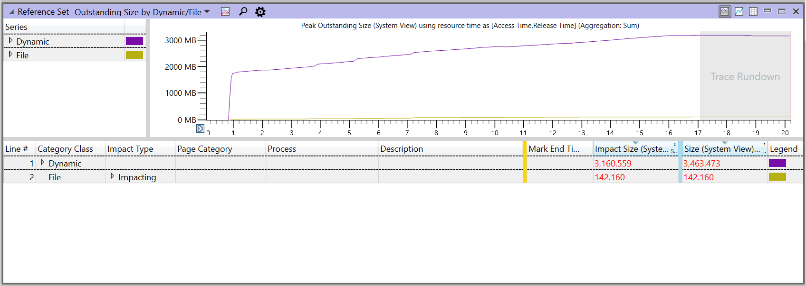

# 参考设置和内存使用的系统范围内影响 

*设置引用*的是系统的推荐的方式，以了解进程作为一个整体内存可用性上的实际效果。

传统上，内存的使用具有测量*工作集*的进程在给定的时间。 进程的工作集是进程的虚拟地址空间中当前驻留在物理内存中的页的集合。 （有关工作集的详细信息，请参阅[处理设置](https://msdn.microsoft.com/en-us/library/windows/desktop/cc441804.aspx)Windows 开发人员中心上。

## 工作集的限制

工作集提供的信息有限，因为它不显示的所有内存，用来支持该进程，该进程使用的系统服务使用的内存缓存的文件等。
此外，工作集是高度依赖于状态的机器、 RAM，其数量和活动内存子系统的需要提供所请求的内存的系统上的所有进程 （*内存压力*级别） 的级别。 此外，工作集极大地受操作系统的修整策略的影响。 因此，工作集是瞬息的度量值，并忽略目标进程之外的效果。

## 参照组的优点

相反，引用集是任何进程或系统中的活动具有在给定方案过程中访问的内存页的系统范围内套的度量单位。 它包括所有页面访问后台正在调查，无论哪个进程访问页面的组件。
引用一组在根据内存大小、 内存压力或 OS 修整策略时不会有所不同。 因为引用集中包括的页当前正在任何进程的工作集或访问系统进程或驱动程序，通过测量参考集是非常准确地评估跨任何负载的系统内存的使用情况。 引用组所特有的情况下，不到一会儿︰ 无效则提出，*此时是我进程的引用集什么？* 但是，就是有效，要问，*什么是引用组中这种情况下的系统的？*或*的引用一套我在此方案中的过程是什么？*

引用组背后的理念很简单︰ 要给予准确的内存引用的系统在方案范围内，页面进行计数访问时和释放时。 此方法提供的综合视图到内存使用高峰期，以及什么是未完成的情况 （即*稳定的使用*） 的末尾。

<blockquote>
<b>注意</b>&nbsp;&nbsp;&nbsp;捕获，则只有第一个页面的引用。
</blockquote>

引用组可以大致视为一种可能方案执行期间从系统的其余部分执行的内存量或需要出现故障，并为了执行方案 （如果系统的其他部分会导致页被换出的内存） 从磁盘中读取的内存量，也可以说。 因此，引用集是有价值的确定内存使用情况的*性能影响*。

# 如何收集参考集数据

您可以使用两个不同的命令行工具来收集引用一组数据︰ Windows 性能记录器 (WPR) 和 Xperf。 您还可以使用 WPR GUI 界面。

WPR 和 Xperf 是 Windows 性能工具包，其中包含在 Windows 评估和部署工具包 (ADK) 的一部分。 您可以从下面的链接下载 Windows 10 的 ADK: [Windows 评估和部署工具包](http://go.microsoft.com/fwlink/p/?LinkId=526740)。 

<blockquote>
<b>注意</b>&nbsp;&nbsp;&nbsp;收集参考设置数据时使用提升权限的命令提示符。
</blockquote>

## 与 WPR 收集数据

若要收集与 WPR 数据，请输入︰

&nbsp;&nbsp;&nbsp;&nbsp;&nbsp;**wpr-启动 referenceset filemode**

运行您的方案，并随即停止收集输入的数据︰

&nbsp;&nbsp;&nbsp;&nbsp;&nbsp;**wpr-停止**&nbsp;<i>文件名</i><b>.etl</b>

## 使用 Xperf 收集数据

当使用 Xperf 收集内存跟踪，指定大小相同的最小值和最大的缓冲区，以确保一致系统保留的内存量为跟踪 Windows 事件 (ETW)。
这种一致性将运行更容易由于减少可变性之间的比较。 （这些缓冲区将自动设置为相同的大小在使用 WPR。）

若要随 Xperf 收集，请输入︰

<blockquote>
<b>xperf-referenceset-minbuffers 50-maxbuffers 50-buffersize 1024 stackwalk 在 PageAccess + PageRelease + PageRangeAccess + PageRangeRelease + PagefileMappedSectionCreate + VirtualFree + PagefileMappedSectionDelete-启动用户-Win32HeapRanges-minbuffers 10--maxbuffers 10-buffersize 1024 上</b>
</blockquote>

运行您的方案，并随即停止收集输入的数据︰

&nbsp;&nbsp;&nbsp;&nbsp;&nbsp;**xperf-停止用户-停止-d**&nbsp;<i>文件名</i><b>.etl</b>

## 收集与 WPR 桌面应用程序的数据

您还可以通过使用 WPR 桌面应用程序，收集数据 wprui.exe。 在 GUI 中，**资源分析**，选择**引用设置分析**。
（如果看不到此选项，您可能需要单击**更多选项**，然后展开**资源分析**。）

要开始录制，请单击**开始**，然后运行您的应用场景。

要停止录制并保存跟踪数据，请单击**保存**。

# 如何引用设置跟踪的工作原理

当 WPR 开始收集参考集的跟踪时，系统立即从中移除所有的内存页包括系统的所有进程的工作集。 此外，保留在系统或进程的工作集的所有页到页锁定，或者标记为不可分页的帐户都记录。 之后，在被移动到备用列表中的页面第一次访问系统中的引用集的跟踪记录软错误，页面被添加到进程的工作集和进程继续运行。
工作集的进程或系统中的页的后续访问不会导致另一个软页面错误，因为页面已经在工作集中。 因此，无需记录的工作集，任何其他页面访问继续执行，因此，对页面的访问总数不会记录在跟踪。

同样，同一进程中任何其它页的第一个访问记录跟踪，包括新分配的页中。 被释放的页 (如通过**HeapFree**)，和被删除文件的具有从测量间隔结束设置引用其*未完成的大小*，但它们仍然显示访问。 文件，都已关闭，或从内存中移除的可执行文件不会从其卓越的大小，因为它们不清除从 RAM 在关闭或删除。 如果两个或多个进程之间共享页面，则跟踪将与它接触的每个进程中记录到该页面的第一次访问。

<blockquote>
<b>注意</b>&nbsp;&nbsp;&nbsp;参考集的跟踪记录可以具有显著影响系统性能，因为所有进程必须都故障大量的页面返回到其工作集后清空其工作集。
</blockquote>

# 参考设置可视化效果

WPA 提供了以下视图的引用一组数据︰

-  [参考设置过程未完成大小](#reference-set-outstanding-size-by-process)
-  [引用将按类别未完成大小设置](#reference-set-outstanding-size-by-category)
-  [参考设置未完成动态/文件大小](#reference-set-outstanding-size-by-dynamic-file)

## 参考设置过程未完成大小

这显示了内存除以视区的进程。 这是如果您正在研究如何对特定应用程序的内存的影响的良好开端。

此视图中的列的含义，请参阅本主题后面部分中[重要的列定义](#important-column-definitions)。

## 按类别设置未完成的引用

这将通过视区的类别显示内存页。

网页类别的说明，请参阅本主题中后面的[网页类别 （动态）](#page-category-dynamic)和[网页类别 （文件）](#page-category-file)。

## 设置未完成动态/文件的引用

这显示了内存内存支持或视区的文件备份是否按分类。

<blockquote>
<b>注意</b>&nbsp;&nbsp;&nbsp;<i>内存支持页面</i>支持页面文件，或在非页面缓冲池，永远不会调出的情况下。 内存支持页包括堆栈、 堆、 VirtualAlloc 和其他网页类别不直接映射到磁盘上的文件。 <i>文件备份页</i>有后盾如模块映像的磁盘上的单个文件。
</blockquote>

# 了解引用设置数据

如前文所述，该参考集表示感兴趣的方案执行期间所接触到的内存。 在这方面，引用一组执行工作负载的实际成本并表示工作负载的内存需求量最精确的统计。

通常，您会感兴趣的特定进程的内存需求量因此都需要开头*引用设置未完成的进程*表。 想要检查的位置，其中的内存使用量增加或减少，以及其巅峰位置和位置很稳定。

## 峰值与稳定状态

由于参考集的在的情况下引用的内存量的度量单位，它可能不直观，其大小可以不断降低。 当内存被释放并返回到系统，以用于其他目的时，将减去引用设置以反映随后可以被重用的事实。

这会导致一个方案有两个主要引用一组度量标准︰*稳态*和*峰值*。

<table>
<tr><th>公制</th><th>说明</th></tr>
<tr><td>稳定&nbsp;状态</td><td>
应用程序或方案的比较基准成本。 这可以通过执行方案 （或多个方案），然后等待再次进入空闲状态的系统进行测量。 通过最小化通过各种方案以一种稳定状态访问您的应用程序的页面数，您可以查看执行较快的情况 （例如，继续执行速度更快），因为您将减少系统上的内存压力，更好地为您的用户体验。
</td></tr>
<tr><td>高峰</td><td>
瞬态使用率过高的内存，可以推动更多有价值的信息，物理内存不足。 通过降低的频率和程度使用任何高峰，您的应用程序或功能将通过降低换出或其他进程终止的可能性是一个更好的"系统公民"。
</td></tr>
</table>

## 重要的列定义

当检查在 WPA 设置引用的跟踪，以下列的表视图中是尤其重要︰

-  [影响类型](#impact-type)
-  [大小和影响大小](#size-and-impact-size)
-  [类别类](#category-class)
-  [网页类别 （动态）](#page-category-dynamic)
-  [网页类别 （文件）](#page-category-file)
-  [分配堆栈](#allocation-stack)
-  [影响堆栈](#impacting-stack)

如果这些列之一是缺少 WPA 中所看到的您可以通过右键单击当前视图中的列标题，然后从列表中选择缺少的列来添加它。

所有三个引用组视图提供了 4 种不同的列提供计数的内存的大小︰

-  **大小 （进程视图）**︰ 给定进程所引用的页的完整集
-  **大小 （系统视图）**︰ 所引用的页面设置 
-  **影响大小 （进程视图）**
-  **影响大小 （系统视图）** 

不同的视图默认情况下，显示不同的列，但如果您查找它们，并施加大小无论何种视图使用它们一样，它们是所有 refset 视图中所有可用。

### 影响类型

**影响类型**列标识类型的内存分配对当前正在使用的内存的效果︰ **Impacting**，**瞬间**，**持续**。

<table>
<tr><th>影响&nbsp;类型</th><th>说明</th></tr>
<tr>
<td>影响</td>
<td>
是 (A) 的内存分配您的视区开始之前和期间您的视区 （外部分配和释放内） 或 (B) 释放期间视您分配和释放您的视区 （内部分配和释放外） 结束后。 会影响分配影响视区的结尾处使用的内存。
</td>
</tr>
<tr>
<td>瞬态</td>
<td>
内存分配和释放期间您的视区 （内部分配和释放内）。 暂时分配是仅在当前视区中的活动。
暂时分配通常导致任何高峰在视区中的使用情况。
</td>
</tr>
<tr>
<td>持久性</td>
<td>
视区开始之前分配和释放它 （外部分配和释放外） 结束后的分配。 在视区的完整过程，永久分配处于活动状态。
</td>
</tr>
</table>

### 大小和影响大小

**大小**列**引用设置未处理**的进程表示的访问中，独立于类型的效果 （**影响类型**列中显示），会导致分配，这可能是一个**Impacting**、**瞬时性**，或**持续**的*量*。
这不是非常有价值的分析，但它需要在 WPA 网络图表。

**影响大小**与当前缩放级别的结束时间戳从起始时间戳表示大小的影响。 比较图表值的开始和结束的视角，简单地说，相当于增量。 暂时性或永久性的访问不会导致要为缩放窗口中，更改的图表的值，因此它们不计。

当两个过程都引用相同的物理内存页时，页面进行计数**大小**列中每个进程。 添加两个值不会产生引用集的系统范围内总因为网页添加到工作集后，后续访问未计入。 在**影响大小**的列中，也计算在内页，只是之后的第一个进程访问的页。 添加值的**影响大小**的进程产生参考集的有效系统范围内总，它执行时不丢失或相乘的任何页计数。 因此，**影响**大小的值表示对内存的实际系统级影响。 

考虑一个示例，从 t\_开始到 t\_结束，请使用下面的值︰

-   在 t 图\_开始︰ 10 MB

-   在窗口中的新 (Impacting) 访问︰ 10 MB

-   在窗口中访问的瞬态︰ 10 MB

-   在 t 图\_结尾︰ 10 （持续） + 10 (Impacting) = 20

-   列的大小︰ 10 （持续） + 10 （瞬时） + 10 (Impacting) = 30

-   影响大小列︰ 10 (Impacting)

<blockquote>
<b>注意</b>&nbsp;&nbsp;&nbsp;放大和缩小更改视区，并将导致重新计算这些大小。
</blockquote>

### 类别类

有两种类别的**类别类**列中标识在 WPA 的内存页面的访问︰**动态**或**文件**。

<table>
<tr><th>类别&nbsp;类</th><th>说明</th></tr>
<tr><td>动态</td><td>
这些都是不会持续整个系统关闭的按需分配与进程相关联的内存或系统状态。 分配可以非分页或由页面文件，备份，也可以<b>堆</b>、 <b>VirtualAlloc</b>，等等，标识<b>页类别</b>列中。 可共享的动态内存还在<b>网页类别</b>中标识为<b>PFMappedSection</b>。
</td></tr>
<tr><td>对象。</td><td>
这些是由磁盘上的文件备份的文件引用的处理。 加载数据时，加载图像文件的文件 (可执行文件或 DLL)，然后将映射文件。
</td></tr>
</table>

### 网页类别 （动态）

在**页类别**列中，如果类别类的**动态**，WPA 将显示一个或多个下表中描述的类别。

<table>
<thead>
<tr class="header">
<th>页面&nbsp;类别中，动态分配</th>
<th>说明</th>
</tr>
</thead>
<tbody>
<tr class="odd">
<td>VirtualAlloc</td>
<td>此网页类别包括大 （大于 512 KB 或 1 MB，这取决于系统） 的动态分配动态分配所做的应用程序 （或由代表该应用程序的框架） 通过虚拟分配的 Api。</td>
</tr>
<tr class="even">
<td>堆</td>
<td>此页类别包含由应用程序进行的小、 动态分配 （或由代表该应用程序的框架） 使用堆分配的 Api。</td>
</tr>
<tr class="odd">
<td>UserStack</td>
<td>用户模式线程的堆栈。</td>
</tr>
<tr class="even">
<td>PFMappedSection</td>
<td>可共享的动态内存。 此网页类别通常测量所用的图形分配的内存量。 从应用程序角度看，这包括不仅图像、 视频、 其他"介质管线"分配您的应用程序正在使用，但也包括您的 UI，例如，用于呈现列表视图的曲面的基本构造块。</td>
</tr>
<tr class="odd">
<td>CopyOnWriteImage</td>
<td>写入时拷贝的页面模块加载到进程中。</td>
</tr>
<tr class="even">
<td>LargePage</td>
<td></td>
</tr>
<tr class="odd">
<td>AWEPage</td>
<td>由进程分配的物理页。</td>
</tr>
<tr class="even">
<td>PageTable</td>
<td></td>
</tr>
<tr class="odd">
<td>PagedPool</td>
<td>内核堆。</td>
</tr>
<tr class="even">
<td>非 PagedPool</td>
<td>非分页内核堆。</td>
</tr>
<tr class="odd">
<td>SessionPrivate</td>
<td></td>
</tr>
<tr class="even">
<td>KernelStack</td>
<td>内核模式堆栈。</td>
</tr>
<tr class="odd">
<td>驱动程序</td>
<td></td>
</tr>
<tr class="even">
<td>DriverLockedSystemPage</td>
<td></td>
</tr>
<tr class="odd">
<td>系统 Pte</td>
<td></td>
</tr>
</tbody>
</table>

### 网页类别 （文件）

在**页类别**列中，如果类别类**文件**，WPA 将显示一个或多个下表中描述的类别。

| 页面&nbsp;类别、 文件 | 说明 |
|-----------------------|---------------------------------------------------------------|
| Image                 | 作为一个可执行文件 （如 DLL) 加载的文件。 |
| 映射文件               | 作为数据加载的文件。 |
| 图元文件              | 一个目录或系统日志。 |
| RegistryFile          | 注册表文件。 |
| 取            | 用于提高应用程序的启动速度的信息。 |
| DriverFile            | 作为一个可执行文件加载的驱动程序。 |

### 分配堆栈

**分配堆栈**列标识分配内存的位置。

### 影响堆栈

访问内存时为什么**会影响堆栈**列显示。

# 测量和引用集合中的性能改进建议

以下一般性建议是有用的测量参考集并提高了应用程序或功能对系统的影响。 按以下顺序使用这些建议︰

-   [检查稳定的使用和内存使用峰值](#examine-steady-state-use-and-peak-use-of-memory)

-   [重点关注的最大影响的进程](#focus-on-the-process-with-the-greatest-effects)

-   [定义和分类内存页](#characterize-and-categorize-memory-pages)

<blockquote><b>注意</b>&nbsp;&nbsp;&nbsp;跟踪使用可见作为与<strong>ETW 缓冲区</strong>的描述"ETWB"的非页面缓冲池的内存。</blockquote>

## 检查稳定的使用和内存使用峰值

这两个方面很重要: （1） 使用高峰的需求发生引用集合中的位置以及为什么处于稳定状态情况和 (2) 的一端的内存使用的量。 分析应该首先关注的情况下，稳定的影响，然后查看任何特定峰值的关系图的引用集。

## 重点关注的最大影响的进程

重点的进程，包括关注的进程以及其他系统进程的引用集影响最大。

## 定义和分类内存页

特性描述需要的内存页面动态类别类和文件，并细分成子类别。

### 检查文件类别中的内存页

检查文件访问的最佳办法是通常按路径树中对它们进行分组，然后确定与系统相关的文件 （如 Dll) 的访问和特定于进程的文件访问 （如本地数据库、 文本文件、 jpeg 图像，等等）。

最小化进程特定文件的访问可以减少参考集的大小。 它还可以提高性能，以开始测试应用程序之前或将加载 （*冷方案*） 正在测试的功能。

实质上，诊断参考集的文件部分需要知道该 Dll 是唯一的方案和为什么他们会被加载，以及对您的应用程序或功能的访问 （例如，图像文件时对幻灯片进行解码） 的任何文件。

### 检查内存页中的动态类别

请按以下顺序来分析参考集的跟踪︰

-   [通过网页类别分类](#classify-by-page-category)

-   [应用于堆栈标记](#apply-stack-tags)

-   [执行特定于堆的跟踪](#perform-heap-specific-tracing)

-   [检查分配堆栈使用率过高。](#examine-allocations-stacks-that-have-high-usage)

-   [检查具有重大影响的系统进程](#examine-system-processes-that-have-significant-effects)

-   [分类分析成本和标识选项以减少。](#categorize-to-analyze-costs-and-identify-options-for-reduction)

 

#### 通过网页类别分类

通过网页类别划分到以下︰ **Win32Heap**、 **VirtualAlloc**或**PFMappedSection**。 类别可以被直接归因于该进程。

系统特定类别通常可忽略最初的分析，虽然主要贡献 (超过 2-3 MB) 从页面缓冲的池或内核堆栈通常是值得检查，因为这种卷通常指示的线程或组件，例如注册表滥用。

#### 应用于堆栈标记

应用堆栈标签进行分类，按堆栈内存使用量可以是非常有帮助确定内存使用来源于何处。

#### 执行特定于堆的跟踪

而堆栈标记的引用集可以为您提供了的大致的进程使用的堆，通常需要执行特定堆的跟踪，如果堆使用情况在您的方案中有较大的影响。 引用组不提供必要的粒度分析从分配角度来说，堆，因为只有集引用标识引用的内存页面。 即使堆分配本身是小的但分散在整个堆碎片过多的堆可能显示稳定的足迹遍及堆使用情况。

#### 检查分配堆栈使用率过高。

VirtualAlloc︰ 检查特定分配堆栈包含**VirtualAlloc**的高使用率。 在**分析**选项卡中查看**VirtualAlloc 提交生存时间**显示详细信息提交使用过程。

#### 检查具有重大影响的系统进程

是否有其他系统的进程，导致这种情况下的内存更大效果？ 候选的示例包括服务、 应用程序代理和防病毒扫描程序。

#### 分类分析成本和标识选项以减少

完成上述建议后，然后使用下面的过程来分析对系统影响最大，研究降低内存成本的方法的堆栈。

1.  确定堆栈中具有最高的成本。

2.  使用标注进行分类，为每一个名称与叠为你做。

3.  考虑为每个类别和堆栈的成本是否预期的方案的金额。

4.  考虑是否可以降低峰值的活动方案，例如，分配内存，仅在必要时。

5.  考虑是否可以减少内存使用处于稳定状态。 例如，您可以释放期间稳定状态是特定于方案的并不是必需的资源？ 示例可能包括高速缓存和共用的资源。 释放资源，则可能会降低稳定的内存需求量。
